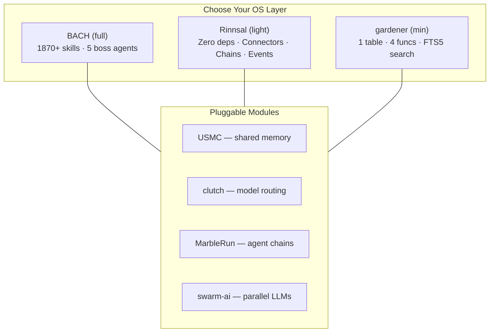

  

<h3 align="center">Extra Large Language Model Operating Systems</h3>

<i>From a spring to a stream — LLM operating systems that flow.</i>

<b>🇩🇪 <a href="https://github.com/ellmos-ai/.github/blob/master/profile/README_de.md">Deutsche Version</a></b>

**ellmos** (XLLM-OS) is a family of text-based operating systems that empower Large Language Models to work autonomously, learn, and self-organize. For machine-readable ecosystem context, see **[llms.txt](https://github.com/ellmos-ai/.github/blob/master/llms.txt)**.

## Public Repository Index

This index is complete for the public `ellmos-ai` repositories. Archived repositories are marked explicitly.

| Area | Repositories |
|---|---|
| Organization profile | **[.github](https://github.com/ellmos-ai/.github)** - org profile, community health files and `llms.txt` |
| LLM operating systems | **[bach](https://github.com/ellmos-ai/bach)**, **[rinnsal](https://github.com/ellmos-ai/rinnsal)**, **[gardener](https://github.com/ellmos-ai/gardener)**, **[ellmos](https://github.com/ellmos-ai/ellmos)** |
| MCP servers | **[ellmos-codecommander-mcp](https://github.com/ellmos-ai/ellmos-codecommander-mcp)**, **[ellmos-filecommander-mcp](https://github.com/ellmos-ai/ellmos-filecommander-mcp)**, **[ellmos-clatcher-mcp](https://github.com/ellmos-ai/ellmos-clatcher-mcp)**, **[n8n-manager-mcp](https://github.com/ellmos-ai/n8n-manager-mcp)**, **[ellmos-controlcenter-mcp](https://github.com/ellmos-ai/ellmos-controlcenter-mcp)**, **[ellmos-homebase-mcp](https://github.com/ellmos-ai/ellmos-homebase-mcp)**, **[ellmos-servercommander-mcp](https://github.com/ellmos-ai/ellmos-servercommander-mcp)** |
| Agent modules and orchestration | **[usmc](https://github.com/ellmos-ai/usmc)**, **[clutch](https://github.com/ellmos-ai/clutch)**, **[connectors](https://github.com/ellmos-ai/connectors)**, **[MarbleRun](https://github.com/ellmos-ai/MarbleRun)**, **[swarm-ai](https://github.com/ellmos-ai/swarm-ai)**, **[n8n-workflow-manager](https://github.com/ellmos-ai/n8n-workflow-manager)**, **[ellmos-stack](https://github.com/ellmos-ai/ellmos-stack)**, **[skills](https://github.com/ellmos-ai/skills)** |
| Evaluation and maintenance | **[ellmos-tests](https://github.com/ellmos-ai/ellmos-tests)** |
| Legacy archive | **[recludos-legacy](https://github.com/ellmos-ai/recludos-legacy)** - archived predecessor to BACH |

## The ellmos Family

Three operating systems — different philosophies, same goal:

<table>
<tr>
<td align="center" width="33%">
 
<b><a href="https://github.com/ellmos-ai/bach">BACH</a></b> 
<i>The stream that unites everything</i> 
Full LLM-OS: 113+ handlers, 1870+ skills, agents, GUI
</td>
<td align="center" width="33%">
 
<b><a href="https://github.com/ellmos-ai/rinnsal">Rinnsal</a></b> 
<i>The trickle</i> 
Lightweight LLM infra: memory, tasks, connectors, chains, i18n. Zero dependencies.
</td>
<td align="center" width="33%">
 
<b><a href="https://github.com/ellmos-ai/gardener">gardener</a></b> 
<i>The zen garden</i> 
LLM-native OS: 1 table, 4 functions, FTS5 search. Everything is searchable.
</td>
</tr>
</table>

## Architecture: 3 OS Layers + Pluggable Modules

The ellmos ecosystem consists of **three OS layers** and **pluggable modules** that can be integrated into any OS — or used standalone.

### Operating Systems

| | **BACH** | **Rinnsal** | **gardener** |
|---|---|---|---|
| **Philosophy** | Maximalist: everything integrated | Lightweight: zero dependencies | Minimalist: 1 table, 4 functions |
| **Database** | SQLite (145+ tables) | SQLite (structured) | SQLite (1 table `everything` + FTS5) |
| **Memory** | 5-type cognitive model | Facts/Notes/Lessons/Sessions | Unified (memo/lesson/recall + decay) |
| **Tasks** | Full GTD (priority, deadline, tags) | Priority + Status + Agent assignment | type='task' in everything |
| **Tools** | 550+ specialized tools | CLI commands | 6 bridge+skin tools (extensible) |
| **Skills/Agents** | 1870+ skills, 5 boss agents, 28 experts | None | None (the LLM is the agent) |
| **Connectors** | Telegram, Email, WhatsApp | Telegram, Discord, Home Assistant | Planned (v0.2+) |
| **GUI** | PySide6 Desktop + Web | CLI only | CLI only |
| **Self-Extension** | `bach skills create` | No | No |
| **Codebase** | ~50,000+ lines | ~2,000 lines | ~1,600 lines |
| **Best for** | Power users, all-in-one | Developers wanting light infra | Minimalists, LLM-native experiments |

### Pluggable Modules & Skills

These modules and skills can be integrated into any OS or used standalone:

<table>
<tr>
<td valign="top" width="55%">

**Modules**

| Module | Purpose |
|---|---|
| **[USMC](https://github.com/ellmos-ai/usmc)** | Cross-agent shared memory |
| **[clutch](https://github.com/ellmos-ai/clutch)** | Provider-neutral model routing |
| **[connectors](https://github.com/ellmos-ai/connectors)** | Portable messaging connectors for AI agents - Telegram, Discord, Signal, WhatsApp, Home Assistant, Webhook; BACH-decoupled via SecretAdapter. |
| **[MarbleRun](https://github.com/ellmos-ai/MarbleRun)** | Chain orchestration |
| **[swarm-ai](https://github.com/ellmos-ai/swarm-ai)** | Parallel LLM coordination |

</td>
<td valign="top" width="45%" align="center">

**Skills**

 
<b><a href="https://github.com/ellmos-ai/skills">skills</a></b> 
<i>Pluggable Skill Library</i> 
Reusable agent skills that slot into any ellmos OS. 
Development, research, education, infrastructure &mdash; pick what you need.

</td>
</tr>
</table>

### How They Fit Together

All projects: **Python 3.10+** | **SQLite** | **MIT License** | **Zero or minimal dependencies**

---

## MCP Servers

<table>
<tr>
<td align="center" width="25%">
 
<b><a href="https://github.com/ellmos-ai/ellmos-codecommander-mcp">CodeCommander</a></b> 
Code analysis & refactoring 
<code>npm i -g ellmos-codecommander-mcp</code>
</td>
<td align="center" width="25%">
 
<b><a href="https://github.com/ellmos-ai/ellmos-filecommander-mcp">FileCommander</a></b> 
File management & batch ops 
<code>npm i -g ellmos-filecommander-mcp</code>
</td>
<td align="center" width="25%">
 
<b><a href="https://github.com/ellmos-ai/ellmos-clatcher-mcp">Clatcher</a></b> 
Utility tools: file repair, format conversion, duplicate detection, batch operations 
<code>npm i -g ellmos-clatcher-mcp</code>
</td>
<td align="center" width="25%">
 
<b><a href="https://github.com/ellmos-ai/n8n-manager-mcp">n8n Manager</a></b> 
n8n workflow automation 
<code>npm i -g n8n-manager-mcp</code>
</td>
</tr>
<tr>
<td align="center" width="25%">
 
<b><a href="https://github.com/ellmos-ai/ellmos-controlcenter-mcp">ControlCenter</a></b> 
MCP profile dashboard, capability bundles & policy audits 
<code>npm i -g ellmos-controlcenter-mcp</code>
</td>
<td align="center" width="25%">
 
<b><a href="https://github.com/ellmos-ai/ellmos-homebase-mcp">Homebase</a></b> 
Local LLM memory, knowledge, state & orchestration 
<code>npm i -g ellmos-homebase-mcp</code>
</td>
<td align="center" width="25%">
 
<b><a href="https://github.com/ellmos-ai/ellmos-servercommander-mcp">ServerCommander</a></b> 
Server health checks, log analysis, deploy dry-runs & mail status 
<code>npm i -g ellmos-servercommander-mcp</code>
</td>
<td width="25%"></td>
</tr>
</table>

## Legacy

<table>
<tr>
<td align="center" width="100%">
 
<b><a href="https://github.com/ellmos-ai/recludos-legacy">recludOS</a></b> 
<i>Archived predecessor to BACH</i> 
Historical reference
</td>
</tr>
</table>

---

## Related Projects in Other Orgs

These projects live in sibling organizations but are particularly relevant to the ellmos multi-agent ecosystem:

| Project | Org | Description |
|---|---|---|
| **[ticket-master](https://github.com/dev-bricks/ticket-master)** | dev-bricks | Cross-platform, multi-provider ticket router / triage console — files structured tickets and routes them to the right AI provider or sub-agent |
| **[lock-master](https://github.com/dev-bricks/lock-master)** | dev-bricks | Portable multi-agent file-lock system — LOCK*.txt-based project/component locking with scopes, expiry, stale-cleanup and a fast overview cache; especially relevant for multi-agent coordination |
| **[knowledgedigest](https://github.com/file-bricks/knowledgedigest)** | file-bricks | Local-first knowledge base with LLM preprocessing — ingest, structure and query documents without cloud dependencies |

---

**[Full documentation](https://github.com/ellmos-ai/ellmos)** | **License:** MIT
