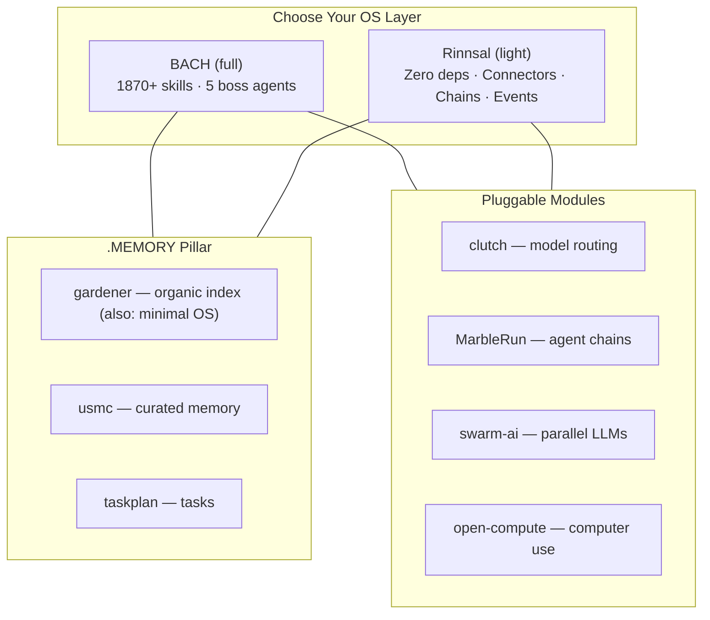

<p align="center">
  
</p>

<h3 align="center">Extra Large Language Model Operating Systems</h3>
<p align="center"><i>From a spring to a stream — LLM operating systems that flow.</i></p>
<p align="center"><b>🇩🇪 <a href="https://github.com/ellmos-ai/.github/blob/master/profile/README_de.md">Deutsche Version</a></b></p>

<p align="center">
  <a href="https://github.com/ellmos-ai"></a>
  <a href="https://github.com/ellmos-ai/bach/blob/main/LICENSE"></a>
  
  
  
  
</p>

> [!NOTE]
> **Ecosystem & Machine Discovery Index:** For machine-readable context, agent-context loading, and comprehensive repository routing, see **[llms.txt](https://github.com/ellmos-ai/.github/blob/master/llms.txt)**. All active software projects in the ellmos-ai organization operate under local-first principles with SQLite persistence, minimal external dependencies, and transparent component composability.

**ellmos** (XLLM-OS) is a family of text-based operating systems that empower Large Language Models to work autonomously, learn, and self-organize.

## Public Repository Index

This index is complete for the public `ellmos-ai` repositories (41 active repos, 1 archived). Archived repositories are marked explicitly. Last checked against GitHub: 2026-07-29.

| Area | Repositories |
|---|---|
| Organization profile | **[.github](https://github.com/ellmos-ai/.github)** - org profile, community health files and `llms.txt` |
| Stack catalog | **[stacks](https://github.com/ellmos-ai/stacks)** - catalog and shared manifest schema for every stack in the ellmos-ai family |
| Operating systems | **[bach](https://github.com/ellmos-ai/bach)**, **[rinnsal](https://github.com/ellmos-ai/rinnsal)**, **[ellmos](https://github.com/ellmos-ai/ellmos)** - plus **[gardener](https://github.com/ellmos-ai/gardener)** as the minimal OS tier when run standalone; it is indexed under [The .MEMORY Pillar](#the-memory-pillar) below |
| Memory pillar | **[usmc](https://github.com/ellmos-ai/usmc)**, **[gardener](https://github.com/ellmos-ai/gardener)**, **[taskplan](https://github.com/ellmos-ai/taskplan)** - curated session memory, organic cross-source index, and task tracking; see [The .MEMORY Pillar](#the-memory-pillar) |
| MCP servers | **[ellmos-codecommander-mcp](https://github.com/ellmos-ai/ellmos-codecommander-mcp)**, **[ellmos-filecommander-mcp](https://github.com/ellmos-ai/ellmos-filecommander-mcp)**, **[ellmos-clatcher-mcp](https://github.com/ellmos-ai/ellmos-clatcher-mcp)**, **[n8n-manager-mcp](https://github.com/ellmos-ai/n8n-manager-mcp)**, **[ellmos-controlcenter-mcp](https://github.com/ellmos-ai/ellmos-controlcenter-mcp)**, **[ellmos-homebase-mcp](https://github.com/ellmos-ai/ellmos-homebase-mcp)**, **[ellmos-servercommander-mcp](https://github.com/ellmos-ai/ellmos-servercommander-mcp)**, **[ellmos-blender-use-mcp](https://github.com/ellmos-ai/ellmos-blender-use-mcp)**, **[open-compute-mcp](https://github.com/ellmos-ai/open-compute-mcp)** |
| Agent modules and orchestration | **[clutch](https://github.com/ellmos-ai/clutch)**, **[connectors](https://github.com/ellmos-ai/connectors)**, **[MarbleRun](https://github.com/ellmos-ai/MarbleRun)**, **[swarm-ai](https://github.com/ellmos-ai/swarm-ai)**, **[roshambo](https://github.com/ellmos-ai/roshambo)** - multi-agent coordinator (serializable leases + outcome memory); **[n8n-workflow-manager](https://github.com/ellmos-ai/n8n-workflow-manager)**, **[workflowhooker](https://github.com/ellmos-ai/workflowhooker)** - workflow lifecycle hooker middleware; **[memoryhooker](https://github.com/ellmos-ai/memoryhooker)** - session lifecycle memory hooker middleware; **[policy-registry](https://github.com/ellmos-ai/policy-registry)** - local-first policy & guardrail registry; **[ellmos-core](https://github.com/ellmos-ai/ellmos-core)** - foundational core runtime & web console; **[ellmos-stack](https://github.com/ellmos-ai/ellmos-stack)**, **[agent-ops-stack](https://github.com/ellmos-ai/agent-ops-stack)**, **[skills](https://github.com/ellmos-ai/skills)**, **[build-your-users-mind](https://github.com/ellmos-ai/build-your-users-mind)**, **[open-compute](https://github.com/ellmos-ai/open-compute)**, **[web-scraper](https://github.com/ellmos-ai/web-scraper)** - standalone web scraper (get/links/forms/headers/extract/screenshot) extracted from BACH, with an SSRF guard; **[anonymizer](https://github.com/ellmos-ai/anonymizer)** - local-first document pseudonymization with fail-closed NER; **[report-forge](https://github.com/ellmos-ai/report-forge)** - domain-neutral core for anonymizable report pipelines; **[task-master](https://github.com/ellmos-ai/task-master)** - deterministic task selection for LLM agents (code-side selector, backlog enforcement, zero dependencies) |
| Domain tools | **[law-checker](https://github.com/ellmos-ai/law-checker)** - source-grounded AI first-look legal assessments for German law (Erstorientierung, no substitute for a lawyer), statute registry and embodiment agents; **[worksheet-generator](https://github.com/ellmos-ai/worksheet-generator)** - generates structured, ICF-aware worksheets for pedagogical and therapeutic use, rendered to Markdown/HTML/DOCX; **[steuer-assistent](https://github.com/ellmos-ai/steuer-assistent)** - offline-first worksheet for German employee income-related expenses (Werbungskosten), with guided collection and plausibility checks and no cloud upload |
| Media and content workflows | **[ai-media-editor](https://github.com/ellmos-ai/ai-media-editor)** - local AI video, audio and podcast editing with local transcription, transcript-based cuts, Hyperframes motion graphics and agent-driven creative edits |
| Evaluation, templates and maintenance | **[ellmos-tests](https://github.com/ellmos-ai/ellmos-tests)**, **[project-docs-template](https://github.com/ellmos-ai/project-docs-template)** - agent-ready project documentation template with START/STATE/TODO/DONE, workflows, lightweight tooling and LLM-friendly project memory; **[clirec](https://github.com/ellmos-ai/clirec)** - human-readable GUI demonstration recordings for CLI and agent workflows |
| Legacy archive | **[recludos-legacy](https://github.com/ellmos-ai/recludos-legacy)** - archived predecessor to BACH |

## The ellmos Family

Two operating systems — different philosophies, same goal — plus a memory pillar either one can plug into:

<table>
<tr>
<td align="center" width="33%">
<br>
<b><a href="https://github.com/ellmos-ai/bach">BACH</a></b><br>
<i>The stream that unites everything</i><br>
Full LLM-OS: 113+ handlers, 1870+ skills, agents, GUI
</td>
<td align="center" width="33%">
<br>
<b><a href="https://github.com/ellmos-ai/rinnsal">Rinnsal</a></b><br>
<i>The trickle</i><br>
Lightweight LLM infra: memory, tasks, connectors, chains, i18n. Zero dependencies.
</td>
<td align="center" width="33%">
<br>
<b><a href="https://github.com/ellmos-ai/gardener">gardener</a></b><br>
<i>The zen garden</i><br>
Two roles, both current: the ellmos <b>memory module</b> (organic cross-source index) when composed into the pillar, and a minimal, LLM-native <b>OS</b> when run standalone: 1 table, 4 functions, FTS5 search.
</td>
</tr>
</table>

Which role applies is a deployment question, not a ranking: composed into the [.MEMORY pillar](#the-memory-pillar) below, gardener is its organic cross-source index; run on its own, it is the minimal OS tier. Both are fully supported.

## The .MEMORY Pillar

ellmos memory isn't one repo — it's three focused modules that combine into the family's standard memory stack, importable as a dependency by any OS layer (BACH, Rinnsal) instead of each one rebuilding its own memory/task system:

| Module | Role |
|---|---|
| **[usmc](https://github.com/ellmos-ai/usmc)** | Curated session/core memory — the **facade and entry point** of the memory system. Push model: "what I consciously remember." |
| **[gardener](https://github.com/ellmos-ai/gardener)** | Memory **supplier**: organic growth via absorb/decay, plus a federated cross-source FTS5 index via `observe()` that cites results back to their source. Pull model: "index what's already there." |
| **[taskplan](https://github.com/ellmos-ai/taskplan)** | Standalone SQLite task module — tasks stay separate from knowledge memory. Zero dependencies. |

## Architecture: OS Layers, Memory Pillar & Pluggable Modules

The ellmos ecosystem consists of **operating systems**, the **.MEMORY pillar**, and **pluggable modules** that can be integrated into any OS — or used standalone.

### Operating Systems

| | **BACH** | **Rinnsal** | **gardener** *(memory pillar primary, OS secondary)* |
|---|---|---|---|
| **Philosophy** | Maximalist: everything integrated | Lightweight: zero dependencies | Minimalist: 1 table, 4 functions |
| **Database** | SQLite (145+ tables) | SQLite (structured) | SQLite (1 table `everything` + FTS5) |
| **Memory** | 5-type cognitive model | Facts/Notes/Lessons/Sessions | Unified (memo/lesson/recall + decay) |
| **Tasks** | Full GTD (priority, deadline, tags) | Priority + Status + Agent assignment | type='task' in everything |
| **Tools** | 550+ specialized tools | CLI commands | 6 bridge+skin tools (extensible) |
| **Skills/Agents** | 1870+ skills, 5 boss agents, 28 experts | None | None (the LLM is the agent) |
| **Connectors** | Telegram, Email, WhatsApp | Telegram, Discord, Home Assistant | Planned (v0.2+) |
| **GUI** | PySide6 Desktop + Web | CLI only | CLI only |
| **Self-Extension** | `bach skills create` | No | No |
| **Codebase** | ~50,000+ lines | ~2,000 lines | ~1,600 lines |
| **Best for** | Power users, all-in-one | Developers wanting light infra | Minimalists, LLM-native experiments; standalone use of the .MEMORY pillar |

### Pluggable Modules & Skills

These modules and skills can be integrated into any OS or used standalone:

<table>
<tr>
<td valign="top" width="55%">

**Modules**

*(USMC, gardener and taskplan now live in the [.MEMORY pillar](#the-memory-pillar) above.)*

| Module | Purpose |
|---|---|
| **[clutch](https://github.com/ellmos-ai/clutch)** | Provider-neutral model routing |
| **[connectors](https://github.com/ellmos-ai/connectors)** | Portable messaging connectors for AI agents - Telegram, Discord, Signal, WhatsApp, Home Assistant, Webhook; BACH-decoupled via SecretAdapter. |
| **[MarbleRun](https://github.com/ellmos-ai/MarbleRun)** | Chain orchestration |
| **[swarm-ai](https://github.com/ellmos-ai/swarm-ai)** | Parallel LLM coordination |
| **[roshambo](https://github.com/ellmos-ai/roshambo)** | Multi-agent coordinator: serializable leases + outcome memory on CockroachDB |
| **[workflowhooker](https://github.com/ellmos-ai/workflowhooker)** | Workflow lifecycle hooker middleware & execution tracking for LLM agent workflows |
| **[memoryhooker](https://github.com/ellmos-ai/memoryhooker)** | Lifecycle memory hooker middleware & event listeners for LLM agent sessions |
| **[policy-registry](https://github.com/ellmos-ai/policy-registry)** | Local-first policy registry & guardrail enforcement schemas |
| **[ellmos-core](https://github.com/ellmos-ai/ellmos-core)** | Foundational core runtime, web console & agent interface contracts (FastAPI + HTMX) |
| **[build-your-users-mind](https://github.com/ellmos-ai/build-your-users-mind)** | Per-user theory of mind: a decision avatar built from interaction logs (feedback precognition) |
| **[open-compute](https://github.com/ellmos-ai/open-compute)** | Model-agnostic computer-use core for Claude, OpenAI CUA and mock backends with normalized coordinates, canonical actions and a central safety gate |
| **[web-scraper](https://github.com/ellmos-ai/web-scraper)** | Standalone web scraper extracted from BACH — get/links/forms/headers/extract/screenshot, with an SSRF guard |
| **[project-docs-template](https://github.com/ellmos-ai/project-docs-template)** | Agent-ready project documentation template with START/STATE/TODO/DONE, workflows, lightweight checks and LLM-friendly project memory |
| **[anonymizer](https://github.com/ellmos-ai/anonymizer)** | Local-first document pseudonymization: fail-closed NER, authenticated key encryption, all-or-nothing publication contract |
| **[report-forge](https://github.com/ellmos-ai/report-forge)** | Domain-neutral core for anonymizable report pipelines: extract sources, build a schema-bound LLM prompt, fill a Word template |

</td>
<td valign="top" width="45%" align="center">

**Skills**

<a href="https://github.com/ellmos-ai/skills"></a><br>
<b><a href="https://github.com/ellmos-ai/skills">skills</a></b><br>
<i>Pluggable Skill Library</i><br>
Reusable agent skills that slot into any ellmos OS.<br>
Development, research, education, infrastructure &mdash; pick what you need.

</td>
</tr>
</table>

### Media and Content Workflows

| Project | Purpose |
|---|---|
| **[ai-media-editor](https://github.com/ellmos-ai/ai-media-editor)** | Local AI media-editing orchestrator for video, audio and podcasts: local STT with faster-whisper or WhisperX, Scribe-compatible transcript JSON, video-use transcript cuts, Hyperframes motion graphics and agent-guided creative edits. |

### How They Fit Together


```mermaid
flowchart TD
  subgraph OS["Choose Your OS Layer"]
    BACH["BACH (full)<br/>1870+ skills · 5 boss agents"]
    RIN["Rinnsal (light)<br/>Zero deps · Connectors · Chains · Events"]
  end
  subgraph MEM[".MEMORY Pillar"]
    GAR["gardener — organic index (also: minimal OS)"]
    USMC["usmc — curated memory"]
    TASK["taskplan — tasks"]
  end
  subgraph MOD["Pluggable Modules"]
    CLUTCH["clutch — model routing"]
    MARBLE["MarbleRun — agent chains"]
    SWARM["swarm-ai — parallel LLMs"]
    OCOMP["open-compute — computer use"]
  end
  BACH --- MEM
  RIN --- MEM
  BACH --- MOD
  RIN --- MOD
```

All projects: **Python 3.10+** | **SQLite** | **MIT License** | **Zero or minimal dependencies**

---

## Stacks

Stacks are manifest-driven compositions (`ellmos.stack.v2`) — no code copies, just declared components. Two active public stacks anchor the family, catalogued in a third:

| Stack | Purpose | Core modules |
|---|---|---|
| **[stacks](https://github.com/ellmos-ai/stacks)** | Catalog and shared manifest schema for every stack in the ellmos-ai family | — |
| **[ellmos-stack](https://github.com/ellmos-ai/ellmos-stack)** | Self-hosted, local-first AI research base: Ollama, n8n, Rinnsal memory, Docker Compose automation | Rinnsal · **[KnowledgeDigest](https://github.com/file-bricks/knowledgedigest)** (file-bricks) · Ollama · n8n |
| **[agent-ops-stack](https://github.com/ellmos-ai/agent-ops-stack)** | Coordination layer for CLI coding agents: ticket routing, file locking, cross-machine sync, decision-avatar, MCP control plane | **[ticket-master](https://github.com/dev-bricks/ticket-master)** (dev-bricks) · **[lock-master](https://github.com/dev-bricks/lock-master)** (dev-bricks) · **[sync-master](https://github.com/dev-bricks/sync-master)** (dev-bricks) · [build-your-users-mind](https://github.com/ellmos-ai/build-your-users-mind) · [skills](https://github.com/ellmos-ai/skills) · ellmos-controlcenter-mcp · ellmos-homebase-mcp |

A number of these modules are deliberately **both**: standalone dev tools you can adopt individually, and stack components you get automatically by installing the stack. That also applies to **[llm-note](https://github.com/doc-bricks/llm-note)** (doc-bricks) — local-first notebooks for LLM agents, built as a pluggable module for stack composition.

---

## Composition Model

ellmos keeps implementation units small and independently useful, while making larger, reproducible compositions explicit:

```text
Module → Bundle → Stack → System → Fleet
```

- A **module** is independently versioned and can be adopted on its own. Public modules remain useful as individual, generally freely available building blocks.
- A **bundle** is a versioned, compatibility-checked set of modules and typed partners, including reusable skills where appropriate.
- A **stack** wires one or more bundles for a specific operational purpose.
- A **system** combines stacks for one installation or product edition; a **fleet** coordinates multiple system instances.

Bundle, stack, and system manifests describe composition, compatible versions, declared interfaces, and optional lockfiles. They do not copy module source code. Public recipes can be shared openly; private or commercial recipes may combine public and private components without exposing their protected wiring, profiles, or customer configuration. The planned `.BUNDLES` and `.SYSTEMS` manifest layers make these boundaries discoverable without turning this public profile into a private configuration registry. Installer implementations and runtime activation remain release- and deployment-specific; this page does not imply that a particular installer or runtime is available.

Skills are first-class, typed bundle partners resolved through the skills registry, not unversioned prose appended to a deployment. A self-care skill such as `automation-self-care` may be declared by an automation bundle for safe, disabled-by-default acquisition and review; declaring it never silently enables a scheduler, changes an automation, or grants access to credentials.

### Access Surfaces Are Not Functional Owners

MCP servers are access surfaces — also called MCP stacks — for people and LLM clients. They expose capabilities provided by underlying modules and policies; an MCP endpoint is not automatically the owner of the function or its data. **ControlCenter MCP** retains its published identity as an access surface. **ControlRoom** is the operator-oriented composition that can bring together control, health, policy, and evidence views without replacing the functional owners. Homebase follows the same separation: an access surface may route to a capability, while the referenced module, policy, or system manifest remains authoritative.

---

## MCP Servers

<table>
<tr>
<td align="center" width="25%">
<br>
<b><a href="https://github.com/ellmos-ai/ellmos-codecommander-mcp">CodeCommander</a></b><br>
Code analysis & refactoring<br>
<code>npm i -g ellmos-codecommander-mcp</code>
</td>
<td align="center" width="25%">
<br>
<b><a href="https://github.com/ellmos-ai/ellmos-filecommander-mcp">FileCommander</a></b><br>
File management & batch ops<br>
<code>npm i -g ellmos-filecommander-mcp</code>
</td>
<td align="center" width="25%">
<br>
<b><a href="https://github.com/ellmos-ai/ellmos-clatcher-mcp">Clatcher</a></b><br>
Utility tools: file repair, format conversion, duplicate detection, batch operations<br>
<code>npm i -g ellmos-clatcher-mcp</code>
</td>
<td align="center" width="25%">
<br>
<b><a href="https://github.com/ellmos-ai/n8n-manager-mcp">n8n Manager</a></b><br>
n8n workflow automation<br>
<code>npm i -g n8n-manager-mcp</code>
</td>
</tr>
<tr>
<td align="center" width="25%">
<br>
<b><a href="https://github.com/ellmos-ai/ellmos-controlcenter-mcp">ControlCenter</a></b><br>
MCP profile dashboard, capability bundles & policy audits<br>
<code>npm i -g ellmos-controlcenter-mcp</code>
</td>
<td align="center" width="25%">
<br>
<b><a href="https://github.com/ellmos-ai/ellmos-homebase-mcp">Homebase</a></b><br>
Local LLM memory, knowledge, state & orchestration<br>
<code>npm i -g ellmos-homebase-mcp</code>
</td>
<td align="center" width="25%">
<br>
<b><a href="https://github.com/ellmos-ai/ellmos-servercommander-mcp">ServerCommander</a></b><br>
Server health checks, log analysis, deploy dry-runs & mail status<br>
<code>npm i -g ellmos-servercommander-mcp</code>
</td>
<td align="center" width="25%">
<br>
<b><a href="https://github.com/ellmos-ai/ellmos-blender-use-mcp">Blender Use</a></b><br>
Headless Blender asset QA: background runs & FBX reimport checks<br>
<code>npm i -g ellmos-blender-use-mcp</code>
</td>
</tr>
<tr>
<td align="center" width="25%">
<br>
<b><a href="https://github.com/ellmos-ai/open-compute-mcp">open-compute-mcp</a></b><br>
Computer-use: screenshot, safety-gated actions & Windows UIA targeting<br>
<code>npx open-compute-mcp</code>
</td>
</tr>
</table>

## Legacy

<table>
<tr>
<td align="center" width="100%">
<br>
<b><a href="https://github.com/ellmos-ai/recludos-legacy">recludOS</a></b><br>
<i>Archived predecessor to BACH</i><br>
Historical reference
</td>
</tr>
</table>

---

## Related Projects in Other Orgs

These projects live in sibling organizations but are particularly relevant to the ellmos multi-agent ecosystem:

| Project | Org | Description |
|---|---|---|
| **[ticket-master](https://github.com/dev-bricks/ticket-master)** | dev-bricks | Cross-platform, multi-provider ticket router / triage console — files structured tickets and routes them to the right AI provider or sub-agent |
| **[lock-master](https://github.com/dev-bricks/lock-master)** | dev-bricks | Portable multi-agent file-lock system — LOCK*.txt-based project/component locking with scopes, expiry, stale-cleanup and a fast overview cache; especially relevant for multi-agent coordination |
| **[sync-master](https://github.com/dev-bricks/sync-master)** | dev-bricks | Serverless cross-machine sync yard for multi-agent setups — slot-per-host write ownership, a gated daily sync ritual, message channels and a bootstrap runbook; the transport layer that keeps several machines and their agents in step |
| **[companion-for-agy](https://github.com/dev-bricks/companion-for-agy)** | dev-bricks | PTY-based wrapper that captures agy (Gemini CLI) responses via ANSI color extraction — lets Claude Code, Codex and CI pipelines read Gemini output reliably |
| **[llm-note](https://github.com/doc-bricks/llm-note)** | doc-bricks | Local-first notes and notebook inboxes for LLM agents — extracted from BACH Notizblock/Denkarium patterns with SQLite, plain-text notebooks and six locales |
| **[knowledgedigest](https://github.com/file-bricks/knowledgedigest)** | file-bricks | Local-first knowledge base with LLM preprocessing — ingest, structure and query documents without cloud dependencies; core module of [ellmos-stack](https://github.com/ellmos-ai/ellmos-stack) |

---

**[Full documentation](https://github.com/ellmos-ai/ellmos)** | **License:** MIT
