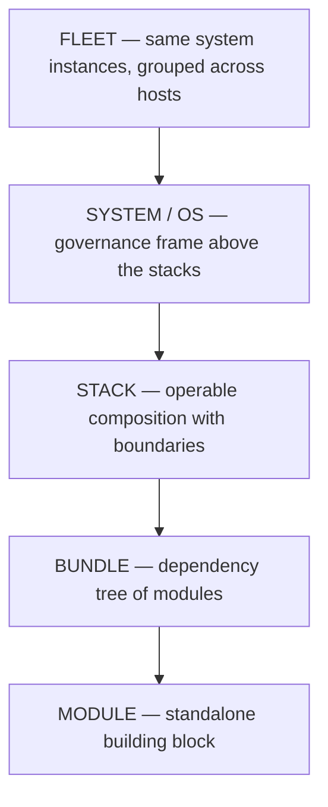

  

> [!NOTE]
> **Ecosystem & Machine Discovery Index:** For machine-readable context, agent-context loading, and comprehensive repository routing, see **[llms.txt](https://github.com/ellmos-ai/.github/blob/master/llms.txt)**. All active software projects in the ellmos-ai organization operate under local-first principles with SQLite persistence, minimal external dependencies, and transparent component composability.

**ellmos** (XLLM-OS) is a family of text-based operating systems that empower Large Language Models to work autonomously, learn, and self-organize.

## Public Repository Index

This index is complete for the public `ellmos-ai` repositories (51 repos, 1 archived). Archived repositories are marked explicitly. Last checked against GitHub: 2026-08-05.

| Area | Repositories |
|---|---|
| Organization profile | **[.github](https://github.com/ellmos-ai/.github)** - org profile, community health files and `llms.txt` |
| Stack catalog | **[stacks](https://github.com/ellmos-ai/stacks)** - catalog and shared manifest schema for every stack in the ellmos-ai family |
| Operating systems | **[bach](https://github.com/ellmos-ai/bach)**, **[rinnsal](https://github.com/ellmos-ai/rinnsal)**, **[ellmos](https://github.com/ellmos-ai/ellmos)** - plus **[gardener](https://github.com/ellmos-ai/gardener)** as the minimal OS tier when run standalone; it is indexed under [Memory and Control](#memory-and-control) below |
| Memory pillar | **[usmc](https://github.com/ellmos-ai/usmc)**, **[gardener](https://github.com/ellmos-ai/gardener)**, **[task-master](https://github.com/ellmos-ai/task-master)** - curated session memory, organic cross-source index, and task tracking; see [Memory and Control](#memory-and-control) |
| MCP servers | **[ellmos-codecommander-mcp](https://github.com/ellmos-ai/ellmos-codecommander-mcp)**, **[ellmos-filecommander-mcp](https://github.com/ellmos-ai/ellmos-filecommander-mcp)**, **[ellmos-clatcher-mcp](https://github.com/ellmos-ai/ellmos-clatcher-mcp)**, **[n8n-manager-mcp](https://github.com/ellmos-ai/n8n-manager-mcp)**, **[ellmos-controlcenter-mcp](https://github.com/ellmos-ai/ellmos-controlcenter-mcp)**, **[ellmos-homebase-mcp](https://github.com/ellmos-ai/ellmos-homebase-mcp)**, **[ellmos-servercommander-mcp](https://github.com/ellmos-ai/ellmos-servercommander-mcp)**, **[ellmos-blender-use-mcp](https://github.com/ellmos-ai/ellmos-blender-use-mcp)**, **[open-compute-mcp](https://github.com/ellmos-ai/open-compute-mcp)** |
| Agent modules and orchestration | **[clutch](https://github.com/ellmos-ai/clutch)**, **[connectors](https://github.com/ellmos-ai/connectors)**, **[MarbleRun](https://github.com/ellmos-ai/MarbleRun)**, **[swarm-ai](https://github.com/ellmos-ai/swarm-ai)**, **[n8n-workflow-manager](https://github.com/ellmos-ai/n8n-workflow-manager)**, **[ellmos-stack](https://github.com/ellmos-ai/ellmos-stack)**, **[agent-ops-stack](https://github.com/ellmos-ai/agent-ops-stack)**, **[skills](https://github.com/ellmos-ai/skills)**, **[build-your-users-mind](https://github.com/ellmos-ai/build-your-users-mind)**, **[open-compute](https://github.com/ellmos-ai/open-compute)**, **[web-scraper](https://github.com/ellmos-ai/web-scraper)** - standalone web scraper (get/links/forms/headers/extract/screenshot) extracted from BACH, with an SSRF guard; **[anonymizer](https://github.com/ellmos-ai/anonymizer)** - local-first document pseudonymization with fail-closed NER; **[report-forge](https://github.com/ellmos-ai/report-forge)** - domain-neutral core for anonymizable report pipelines |
| Agent hooks, evidence and coordination | **[memoryhooker](https://github.com/ellmos-ai/memoryhooker)** - connects local memory sources to coding-agent lifecycle hooks (no network); **[workflowhooker](https://github.com/ellmos-ai/workflowhooker)** - configurable workflow checks at agent lifecycle events, zero dependencies; **[roshambo](https://github.com/ellmos-ai/roshambo)** - multi-agent coordinator: serializable leases + outcome memory on CockroachDB; **[roshambo-starmap](https://github.com/ellmos-ai/roshambo-starmap)** - evidence artefact of the multi-vendor swarm run coordinated by roshambo |
| Agent operations tooling | **[ticket-master](https://github.com/ellmos-ai/ticket-master)** - multi-provider ticket router and triage console for CLI coding agents; **[lock-master](https://github.com/ellmos-ai/lock-master)** - portable multi-agent file-lock system; **[system-gap-master](https://github.com/ellmos-ai/system-gap-master)** - serverless cross-machine sync yard; **[coma](https://github.com/ellmos-ai/coma)** - agent lifecycle layer (spawn, file protocol, status polling); **[companion-for-agy](https://github.com/ellmos-ai/companion-for-agy)** - PTY wrapper that makes agy (Gemini CLI) output readable for automation |
| Agents | **[hungrycall](https://github.com/ellmos-ai/hungrycall)**, **[ringedingeding](https://github.com/ellmos-ai/ringedingeding)**, **[researchcall](https://github.com/ellmos-ai/researchcall)** - telephone agents built on CALL-E; plus agent roles shipped inside **[ticket-master](https://github.com/ellmos-ai/ticket-master)**, **[task-master](https://github.com/ellmos-ai/task-master)**, **[build-your-users-mind](https://github.com/ellmos-ai/build-your-users-mind)**, **[law-checker](https://github.com/ellmos-ai/law-checker)** and **[ai-media-editor](https://github.com/ellmos-ai/ai-media-editor)**, and as skills (research-agent, dev-soft-agent) in **[skills](https://github.com/ellmos-ai/skills)**; see [Agents](#agents) below |
| Competition entries | **[hungrycall](https://github.com/ellmos-ai/hungrycall)**, **[ringedingeding](https://github.com/ellmos-ai/ringedingeding)**, **[researchcall](https://github.com/ellmos-ai/researchcall)**, **[roshambo](https://github.com/ellmos-ai/roshambo)**, **[roshambo-starmap](https://github.com/ellmos-ai/roshambo-starmap)**, **[build-your-users-mind](https://github.com/ellmos-ai/build-your-users-mind)**, **[bach](https://github.com/ellmos-ai/bach)** - see [Competition Entries](#competition-entries) below |
| Core and system infrastructure | **[sqlite-transit-sync](https://github.com/ellmos-ai/sqlite-transit-sync)** - local-first SQLite synchronization through verified snapshots and configurable row-level merge policies (Python 3.10+, zero dependencies) |
| Domain tools | **[law-checker](https://github.com/ellmos-ai/law-checker)** - source-grounded AI first-look legal assessments for German law (Erstorientierung, no substitute for a lawyer), statute registry and embodiment agents; **[worksheet-generator](https://github.com/ellmos-ai/worksheet-generator)** - generates structured, ICF-aware worksheets for pedagogical and therapeutic use, rendered to Markdown/HTML/DOCX; **[steuer-assistent](https://github.com/ellmos-ai/steuer-assistent)** - offline-first worksheet for German employee income-related expenses (Werbungskosten): records self-categorized receipts and sums them to the cent, entirely locally. It does not assess deductibility and does not file a return - not tax advice |
| Media and content workflows | **[ai-media-editor](https://github.com/ellmos-ai/ai-media-editor)** - local AI video, audio and podcast editing with local transcription, transcript-based cuts, Hyperframes motion graphics and agent-driven creative edits |
| Evaluation, templates and maintenance | **[ellmos-tests](https://github.com/ellmos-ai/ellmos-tests)**, **[project-docs-template](https://github.com/ellmos-ai/project-docs-template)** - agent-ready project documentation template with START/STATE/TODO/DONE, workflows, lightweight tooling and LLM-friendly project memory; **[clirec](https://github.com/ellmos-ai/clirec)** - human-readable GUI demonstration recordings for CLI and agent workflows |
| Legacy archive | **[recludos-legacy](https://github.com/ellmos-ai/recludos-legacy)** - archived predecessor to BACH |

---

## Skills

  

---

## Modules

Our recommended selection — building blocks that integrate into any ellmos OS or stand on their own. The banners are the links; details in the table below:

| Module | Focus |
|---|---|
| **[swarm-ai](https://github.com/ellmos-ai/swarm-ai)** | Parallel LLM coordination |
| **[build-your-users-mind](https://github.com/ellmos-ai/build-your-users-mind)** | Per-user theory of mind: decision avatars built from interaction logs |
| **[web-scraper](https://github.com/ellmos-ai/web-scraper)** | Fetch, extract, structure — standalone scraper with an SSRF guard |
| **[report-forge](https://github.com/ellmos-ai/report-forge)** | Domain-neutral core for anonymizable report pipelines |
| **[ai-media-editor](https://github.com/ellmos-ai/ai-media-editor)** | Local AI video, audio and podcast editing with transcript-based cuts |
| **[clutch](https://github.com/ellmos-ai/clutch)** | Provider-neutral model routing |
| **[MarbleRun](https://github.com/ellmos-ai/MarbleRun)** | Chain orchestration |
| **[n8n-workflow-manager](https://github.com/ellmos-ai/n8n-workflow-manager)** | Local-first n8n management |
| **[open-compute](https://github.com/ellmos-ai/open-compute)** | Computer-use core with safety gate |
| **[connectors](https://github.com/ellmos-ai/connectors)** | Portable messaging connectors & CLI agent bridge |

More modules without their own artwork yet: **[anonymizer](https://github.com/ellmos-ai/anonymizer)** (fail-closed document pseudonymization) · **[project-docs-template](https://github.com/ellmos-ai/project-docs-template)** (agent-ready project documentation)

---

## Bundles

Bundles declare *which module versions belong together*: versioned, compatibility-checked dependency trees.

Our first bundle manifests are registered but still **declarative** (draft lifecycle, no runtime authority yet) — so this section is a preview. First public candidate: the .MEMORY pillar set `usmc + gardener + task-master`.

**Coming soon.**

---

## The Composition Model — Build Your Stack

One idea runs through everything in this ecosystem: **modules compose into something new.** Pick the building blocks you need, wire them your way, and the result is your own stack — not a fixed product edition.

```mermaid
flowchart TD
  FLEET["FLEET — same system instances, grouped across hosts"]
  SYS["SYSTEM / OS — governance frame above the stacks"]
  STACK["STACK — operable composition with boundaries"]
  BUNDLE["BUNDLE — dependency tree of modules"]
  MOD["MODULE — standalone building block"]
  FLEET --> SYS --> STACK --> BUNDLE --> MOD
```

| Layer | Definition | Public example |
|---|---|---|
| **Module** | A building block: one standalone capability, independently versioned and useful on its own. | [gardener](https://github.com/ellmos-ai/gardener), [clutch](https://github.com/ellmos-ai/clutch), every [MCP server](#mcp-servers) |
| **Bundle** | The dependency tree of modules — declares *what belongs together*, as a versioned, compatibility-checked set. | The .MEMORY pillar set: usmc + gardener + task-master ([Memory and Control](#memory-and-control)) |
| **Stack** | An operable composition with boundaries — declares *how it runs together*: data, network, tenants, execution. Size classes: `bundle`, `core`, `full`, `os-stack`. | [ellmos-stack](https://github.com/ellmos-ai/ellmos-stack), [agent-ops-stack](https://github.com/ellmos-ai/agent-ops-stack) |
| **System / OS** | The governance frame above the stacks: policies, identity and lifecycle for one installation or edition. | [bach](https://github.com/ellmos-ai/bach), [rinnsal](https://github.com/ellmos-ai/rinnsal), [ellmos](https://github.com/ellmos-ai/ellmos) |
| **Fleet** | A multi-host grouping of the same system instances — one system, many machines, kept in step. | [roshambo](https://github.com/ellmos-ai/roshambo) with [system-gap-master](https://github.com/ellmos-ai/system-gap-master) |

**Skills play a role on every layer**: they are shipped as pluggable modules, versioned inside bundles, wired into stacks, and surfaced by systems to their agents — one skill library, useful from a single module up to a whole fleet.

Stacks declare composition instead of copying module code — so any composition can be re-wired into something new. An operator "control room", for instance, is not a separate product: it is a stack that wires the existing MCP access surfaces ([ControlCenter](https://github.com/ellmos-ai/ellmos-controlcenter-mcp), [ServerCommander](https://github.com/ellmos-ai/ellmos-servercommander-mcp), [Homebase](https://github.com/ellmos-ai/ellmos-homebase-mcp)) into a single operations view. Same modules, new whole.

---

## Our Premium Systems

*more than a stack*

Some compositions outgrow the stack layer: they are governed systems with their own identity, policies and lifecycle. Two of them are public — the banners are the links:

  
  

| System | What it is |
|---|---|
| **[BACH](https://github.com/ellmos-ai/bach)** | *The stream that unites everything*: the full LLM-OS with 113+ handlers, 1870+ skills, boss agents and GUI. |
| **[Rinnsal](https://github.com/ellmos-ai/rinnsal)** | *The trickle*: lightweight LLM infrastructure — memory, tasks, connectors, chains, i18n. Zero dependencies. |

Different philosophies, same goal — and [gardener](https://github.com/ellmos-ai/gardener) doubles as the minimal OS tier when run standalone (see [Memory and Control](#memory-and-control)).

---

## Stacks

  
   
  
  

Stacks are manifest-driven compositions (`ellmos.stack.v2`) — no code copies, just declared components. Two active public stacks anchor the family, catalogued in a third:

| Stack | Purpose | Core modules |
|---|---|---|
| **[stacks](https://github.com/ellmos-ai/stacks)** | Catalog and shared manifest schema for every stack in the ellmos-ai family | — |
| **[ellmos-stack](https://github.com/ellmos-ai/ellmos-stack)** | Self-hosted, local-first AI research base: Ollama, n8n, Rinnsal memory, Docker Compose automation | Rinnsal · **[KnowledgeDigest](https://github.com/file-bricks/knowledgedigest)** (file-bricks) · Ollama · n8n |
| **[agent-ops-stack](https://github.com/ellmos-ai/agent-ops-stack)** | Coordination layer for CLI coding agents: ticket routing, file locking, cross-machine sync, decision-avatar, MCP control plane | **[ticket-master](https://github.com/ellmos-ai/ticket-master)** · **[lock-master](https://github.com/ellmos-ai/lock-master)** · **[system-gap-master](https://github.com/ellmos-ai/system-gap-master)** · [build-your-users-mind](https://github.com/ellmos-ai/build-your-users-mind) · [skills](https://github.com/ellmos-ai/skills) · ellmos-controlcenter-mcp · ellmos-homebase-mcp |

A number of these modules are deliberately **both**: standalone dev tools you can adopt individually, and stack components you get automatically by installing the stack. That also applies to **[llm-note](https://github.com/doc-bricks/llm-note)** (doc-bricks) — local-first notebooks for LLM agents, built as a pluggable module for stack composition.

---

## MCP Servers — *Stacks that talk*

Nine MCP servers, one control plane — arranged as a vertical **family tree (Stammbaum)**: **Root & main trunk at the bottom** (earliest servers, 2026-02), branching upwards through mid-tier infrastructure (2026-05 to 2026-06) to the **youngest twigs at the top** (2026-07) with server logos hanging as fruits on the branches.

  
  <map name="mcp-stammbaum-map">
    <area shape="rect" coords="61,906,279,1165" href="https://github.com/ellmos-ai/ellmos-filecommander-mcp" alt="FileCommander" title="FileCommander — #1 filecommander · 2026-02">
    <area shape="rect" coords="371,836,589,1095" href="https://github.com/ellmos-ai/ellmos-codecommander-mcp" alt="CodeCommander" title="CodeCommander — #2 codecommander · 2026-02">
    <area shape="rect" coords="811,836,1029,1095" href="https://github.com/ellmos-ai/n8n-manager-mcp" alt="n8n Manager" title="n8n Manager — #3 n8n-manager · 2026-02">
    <area shape="rect" coords="1121,906,1339,1165" href="https://github.com/ellmos-ai/ellmos-clatcher-mcp" alt="Clatcher" title="Clatcher — #4 clatcher · 2026-03">
    <area shape="rect" coords="141,516,359,775" href="https://github.com/ellmos-ai/ellmos-controlcenter-mcp" alt="ControlCenter" title="ControlCenter — #5 controlcenter · 2026-05">
    <area shape="rect" coords="591,446,809,705" href="https://github.com/ellmos-ai/ellmos-homebase-mcp" alt="Homebase" title="Homebase — #6 homebase · 2026-06">
    <area shape="rect" coords="1040,516,1260,775" href="https://github.com/ellmos-ai/ellmos-servercommander-mcp" alt="ServerCommander" title="ServerCommander — #7 servercommander · 2026-06">
    <area shape="rect" coords="241,126,459,385" href="https://github.com/ellmos-ai/ellmos-blender-use-mcp" alt="Blender Use" title="Blender Use — #8 blender-use · 2026-07">
    <area shape="rect" coords="941,126,1159,385" href="https://github.com/ellmos-ai/open-compute-mcp" alt="open-compute" title="open-compute — #9 open-compute · 2026-07">
  </map>

| Server | Focus | Install |
|---|---|---|
| **[CodeCommander](https://github.com/ellmos-ai/ellmos-codecommander-mcp)** | Code analysis & refactoring | `npm i -g ellmos-codecommander-mcp` |
| **[FileCommander](https://github.com/ellmos-ai/ellmos-filecommander-mcp)** | File management & batch ops | `npm i -g ellmos-filecommander-mcp` |
| **[Clatcher](https://github.com/ellmos-ai/ellmos-clatcher-mcp)** | File repair, format conversion, duplicates | `npm i -g ellmos-clatcher-mcp` |
| **[n8n Manager](https://github.com/ellmos-ai/n8n-manager-mcp)** | n8n workflow automation | `npm i -g n8n-manager-mcp` |
| **[ControlCenter](https://github.com/ellmos-ai/ellmos-controlcenter-mcp)** | MCP profile dashboard, capability bundles & policy audits | `npm i -g ellmos-controlcenter-mcp` |
| **[Homebase](https://github.com/ellmos-ai/ellmos-homebase-mcp)** | Local LLM memory, knowledge, state & orchestration | `npm i -g ellmos-homebase-mcp` |
| **[ServerCommander](https://github.com/ellmos-ai/ellmos-servercommander-mcp)** | Server health checks, log analysis, deploy dry-runs | `npm i -g ellmos-servercommander-mcp` |
| **[Blender Use](https://github.com/ellmos-ai/ellmos-blender-use-mcp)** | Headless Blender asset QA | `npm i -g ellmos-blender-use-mcp` |
| **[open-compute-mcp](https://github.com/ellmos-ai/open-compute-mcp)** | Computer use: screenshots, safety-gated actions | `npx open-compute-mcp` |

---

## Memory and Control

The family's memory pillar and its coordination & control modules — first their banners, then the details:

| Module | Role |
|---|---|
| **[usmc](https://github.com/ellmos-ai/usmc)** | Curated session/core memory — the **facade and entry point** of the memory system. Push model: "what I consciously remember." |
| **[gardener](https://github.com/ellmos-ai/gardener)** | Memory **supplier**: organic growth via absorb/decay, plus a federated cross-source FTS5 index via `observe()` that cites results back to their source. Pull model: "index what's already there." Doubles as the minimal OS tier when run standalone. |
| **[task-master](https://github.com/ellmos-ai/task-master)** | Standalone SQLite task module — tasks stay separate from knowledge memory. Zero dependencies. |
| **[ticket-master](https://github.com/ellmos-ai/ticket-master)** | Cross-platform, multi-provider ticket router / triage console — files structured tickets and routes them to the right AI provider or sub-agent. |
| **[lock-master](https://github.com/ellmos-ai/lock-master)** | Portable multi-agent file-lock system — LOCK*.txt-based project/component locking with scopes, expiry and stale-cleanup. |
| **[system-gap-master](https://github.com/ellmos-ai/system-gap-master)** | Serverless sync yard for multi-machine, multi-agent setups — slot rule, gated daily ritual, bootstrap runbook. Family: lock-master, ticket-master. |
| **[coma](https://github.com/ellmos-ai/coma)** | COMAS — COMmunication for Autonomous Subagents: lifecycle layer for agents (spawn, file protocol, status polling). Zero dependencies, standard library only. |
| **[memoryhooker](https://github.com/ellmos-ai/memoryhooker)** | Connects local memory sources to coding-agent lifecycle hooks (no network). |
| **[workflowhooker](https://github.com/ellmos-ai/workflowhooker)** | Configurable workflow checks at agent lifecycle events, zero dependencies. |
| **[companion-for-agy](https://github.com/ellmos-ai/companion-for-agy)** | PTY-based wrapper that captures agy (Gemini CLI) responses via ANSI color extraction — lets Claude Code, Codex and CI pipelines read Gemini output reliably. |

---

## Agents

Telephone agents built on **[CALL-E](https://github.com/CALLE-AI/call-e-integrations)** — each one takes a spoken task off a person's hands and reports back what actually happened, including when nobody picked up.

| Agent | What it does |
|---|---|
| **[hungrycall](https://github.com/ellmos-ai/hungrycall)** | A sequential call cascade for food delivery, table reservations and pickup: ranks candidate restaurants against the user's boundaries, then calls them one after another and stops at the first success. The generalized cascade pattern is documented separately from the food use case. |
| **[ringedingeding](https://github.com/ellmos-ai/ringedingeding)** | Asks one question to several people in your own circle and merges the replies into a single result — either intersecting availability to find a date, or reporting the leading tendency together with countervoices and reasons. It does not turn dissent into a false consensus. |
| **[researchcall](https://github.com/ellmos-ai/researchcall)** | A standardized telephone survey runner with methodological honesty: builds the instrument from its own gated stations, draws a random sample, calls each person once by default, and reports nonresponse instead of collapsing distinct outcomes. Runs fully local as a dry run by default — no account and no real call needed. |

### Agent roles inside our modules

Beyond the telephone agents, several ellmos-ai modules ship their own agents or agent roles:

| Module | Agent role |
|---|---|
| **[ticket-master](https://github.com/ellmos-ai/ticket-master)** | TICKET-MASTER — a long-lived router/triage agent that files structured tickets and dispatches them to the right AI provider or sub-agent |
| **[task-master](https://github.com/ellmos-ai/task-master)** | Three operating roles shipped as agent prompts: TASKSOLVER (works the queue), TASKWRITER (captures tasks), MAINTAINER (keeps the task database healthy) |
| **[build-your-users-mind](https://github.com/ellmos-ai/build-your-users-mind)** | Decision avatar — an agent that learns its user's decision patterns from interaction logs and predicts or takes decisions in their spirit |
| **[law-checker](https://github.com/ellmos-ai/law-checker)** | Statute embodiment agents — configured statutes (e.g. the German constitution and civil code) "speak" as agents — plus a source-grounded first-look assessment agent |
| **[ai-media-editor](https://github.com/ellmos-ai/ai-media-editor)** | Agent-driven creative editing — performs transcript-based cuts and motion-graphics passes on local media |

Agents also ship as **skills** in the [skills](https://github.com/ellmos-ai/skills) library: **[research-agent](https://github.com/ellmos-ai/skills/tree/master/skills/research/research-agent)** — research pipeline for PubMed and arXiv with quick search and structured literature reviews, pure Python standard library, extracted from BACH's ResearchAgent — and **[dev-soft-agent](https://github.com/ellmos-ai/skills/tree/master/skills/dev/dev-soft-agent)** — automated software-development pipeline that scans projects, prioritizes tasks and orchestrates development loops.

Agent *infrastructure* — coordination, orchestration and lifecycle for agents you bring yourself — lives in **[swarm-ai](https://github.com/ellmos-ai/swarm-ai)**, **[roshambo](https://github.com/ellmos-ai/roshambo)**, **[MarbleRun](https://github.com/ellmos-ai/MarbleRun)** and **[coma](https://github.com/ellmos-ai/coma)**.

---

## Competition Entries

Projects built for public hackathons and competitions. Listed as entries — no placement claimed.

| Entry | Competition | What was submitted |
|---|---|---|
| **[hungrycall](https://github.com/ellmos-ai/hungrycall)** | CALL-E "Your Code Is Calling" (Devpost, 2026) | Sequential calling cascade for food delivery and reservations, plus the generalized cascade pattern as the reusable contribution |
| **[ringedingeding](https://github.com/ellmos-ai/ringedingeding)** | CALL-E "Your Code Is Calling" (Devpost, 2026) | Multi-recipient response aggregator: one question, several people, one merged answer |
| **[researchcall](https://github.com/ellmos-ai/researchcall)** | CALL-E "Your Code Is Calling" (Devpost, 2026) | Standardized telephone survey runner with an eight-station research pipeline and honest nonresponse reporting |
| **[roshambo](https://github.com/ellmos-ai/roshambo)** | CockroachDB × AWS Hackathon (2026-07) | Multi-agent coordinator: serializable leases and outcome memory on CockroachDB, with an MCP interface |
| **[roshambo-starmap](https://github.com/ellmos-ai/roshambo-starmap)** | CockroachDB × AWS Hackathon (2026-07) | Evidence artefact of the accompanying multi-vendor swarm run — a replayable field record of 27 agents coordinating through roshambo |
| **[build-your-users-mind](https://github.com/ellmos-ai/build-your-users-mind)** | Agent recipe entry | A recipe for any AI agent to build a self-improving theory-of-mind model of its user from interaction logs |
| **[bach](https://github.com/ellmos-ai/bach)** | Agent OS entry | The full local-first LLM operating system: memory, handlers, skills, agents and GUI |

---

## Related Projects in Other Orgs

These projects live in sibling organizations but are particularly relevant to the ellmos multi-agent ecosystem:

| Project | Org | Description |
|---|---|---|
| **[llm-note](https://github.com/doc-bricks/llm-note)** | doc-bricks | Local-first notes and notebook inboxes for LLM agents — extracted from BACH Notizblock/Denkarium patterns with SQLite, plain-text notebooks and six locales |
| **[knowledgedigest](https://github.com/file-bricks/knowledgedigest)** | file-bricks | Local-first knowledge base with LLM preprocessing — ingest, structure and query documents without cloud dependencies; core module of [ellmos-stack](https://github.com/ellmos-ai/ellmos-stack) |

---

## Legacy

<table>
<tr>
<td align="center" width="100%">
 
<b><a href="https://github.com/ellmos-ai/recludos-legacy">recludOS</a></b> 
<i>Archived predecessor to BACH</i> 
Historical reference
</td>
</tr>
</table>

---

**[Full documentation](https://github.com/ellmos-ai/ellmos)** | **License:** MIT | **🇩🇪 [Deutsche Version](https://github.com/ellmos-ai/.github/blob/master/profile/README_de.md)**
