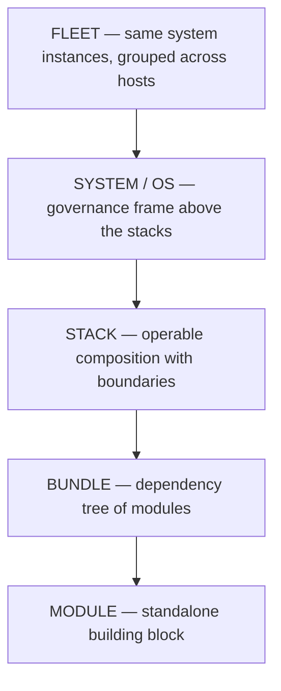

  

> [!NOTE]
> **Ecosystem & Machine Discovery Index:** For machine-readable context, agent-context loading, and comprehensive repository routing, see **[llms.txt](https://github.com/ellmos-ai/.github/blob/master/llms.txt)**. All active software projects in the ellmos-ai organization operate under local-first principles with SQLite persistence, minimal external dependencies, and transparent component composability.

**ellmos** (XLLM-OS) is a family of text-based operating systems that empower Large Language Models to work autonomously, learn, and self-organize.

## Public Repository Index

This index is complete for the public `ellmos-ai` repositories (48 repos, 1 archived). Archived repositories are marked explicitly. Last checked against GitHub: 2026-07-31.

| Area | Repositories |
|---|---|
| Organization profile | **[.github](https://github.com/ellmos-ai/.github)** - org profile, community health files and `llms.txt` |
| Stack catalog | **[stacks](https://github.com/ellmos-ai/stacks)** - catalog and shared manifest schema for every stack in the ellmos-ai family |
| Operating systems | **[bach](https://github.com/ellmos-ai/bach)**, **[rinnsal](https://github.com/ellmos-ai/rinnsal)**, **[ellmos](https://github.com/ellmos-ai/ellmos)** - plus **[gardener](https://github.com/ellmos-ai/gardener)** as the minimal OS tier when run standalone; it is indexed under [Memory and Control](#memory-and-control) below |
| Memory pillar | **[usmc](https://github.com/ellmos-ai/usmc)**, **[gardener](https://github.com/ellmos-ai/gardener)**, **[task-master](https://github.com/ellmos-ai/task-master)** - curated session memory, organic cross-source index, and task tracking; see [Memory and Control](#memory-and-control) |
| MCP servers | **[ellmos-codecommander-mcp](https://github.com/ellmos-ai/ellmos-codecommander-mcp)**, **[ellmos-filecommander-mcp](https://github.com/ellmos-ai/ellmos-filecommander-mcp)**, **[ellmos-clatcher-mcp](https://github.com/ellmos-ai/ellmos-clatcher-mcp)**, **[n8n-manager-mcp](https://github.com/ellmos-ai/n8n-manager-mcp)**, **[ellmos-controlcenter-mcp](https://github.com/ellmos-ai/ellmos-controlcenter-mcp)**, **[ellmos-homebase-mcp](https://github.com/ellmos-ai/ellmos-homebase-mcp)**, **[ellmos-servercommander-mcp](https://github.com/ellmos-ai/ellmos-servercommander-mcp)**, **[ellmos-blender-use-mcp](https://github.com/ellmos-ai/ellmos-blender-use-mcp)**, **[open-compute-mcp](https://github.com/ellmos-ai/open-compute-mcp)** |
| Agent modules and orchestration | **[clutch](https://github.com/ellmos-ai/clutch)**, **[connectors](https://github.com/ellmos-ai/connectors)**, **[MarbleRun](https://github.com/ellmos-ai/MarbleRun)**, **[swarm-ai](https://github.com/ellmos-ai/swarm-ai)**, **[n8n-workflow-manager](https://github.com/ellmos-ai/n8n-workflow-manager)**, **[ellmos-stack](https://github.com/ellmos-ai/ellmos-stack)**, **[agent-ops-stack](https://github.com/ellmos-ai/agent-ops-stack)**, **[skills](https://github.com/ellmos-ai/skills)**, **[build-your-users-mind](https://github.com/ellmos-ai/build-your-users-mind)**, **[open-compute](https://github.com/ellmos-ai/open-compute)**, **[web-scraper](https://github.com/ellmos-ai/web-scraper)** - standalone web scraper (get/links/forms/headers/extract/screenshot) extracted from BACH, with an SSRF guard; **[anonymizer](https://github.com/ellmos-ai/anonymizer)** - local-first document pseudonymization with fail-closed NER; **[report-forge](https://github.com/ellmos-ai/report-forge)** - domain-neutral core for anonymizable report pipelines |
| Agent hooks, evidence and coordination | **[memoryhooker](https://github.com/ellmos-ai/memoryhooker)** - connects local memory sources to coding-agent lifecycle hooks (no network); **[workflowhooker](https://github.com/ellmos-ai/workflowhooker)** - configurable workflow checks at agent lifecycle events, zero dependencies; **[memoryhooker-provenance](https://github.com/ellmos-ai/memoryhooker-provenance)** / **[workflowhooker-provenance](https://github.com/ellmos-ai/workflowhooker-provenance)** - provenance variants; **[prompt-evidence-collector](https://github.com/ellmos-ai/prompt-evidence-collector)** - local-first prompt/workflow evidence store (extracted from ellmos-core); **[roshambo](https://github.com/ellmos-ai/roshambo)** - multi-agent coordinator: serializable leases + outcome memory on CockroachDB; **[roshambo-starmap](https://github.com/ellmos-ai/roshambo-starmap)** - shared sky/map companion to roshambo |
| Core and system infrastructure | **[ellmos-core](https://github.com/ellmos-ai/ellmos-core)** - core/shell + web UI for ellmos Sovereign (private alpha); **[ellmos-development-system](https://github.com/ellmos-ai/ellmos-development-system)** - private composition recipes and development-system manifests; **[policy-registry](https://github.com/ellmos-ai/policy-registry)** - policy registry module; **[system-explorer](https://github.com/ellmos-ai/system-explorer)** - system exploration tooling |
| Domain tools | **[law-checker](https://github.com/ellmos-ai/law-checker)** - source-grounded AI first-look legal assessments for German law (Erstorientierung, no substitute for a lawyer), statute registry and embodiment agents; **[worksheet-generator](https://github.com/ellmos-ai/worksheet-generator)** - generates structured, ICF-aware worksheets for pedagogical and therapeutic use, rendered to Markdown/HTML/DOCX; **[steuer-assistent](https://github.com/ellmos-ai/steuer-assistent)** - offline-first worksheet for German employee income-related expenses (Werbungskosten), with guided collection and plausibility checks and no cloud upload |
| Media and content workflows | **[ai-media-editor](https://github.com/ellmos-ai/ai-media-editor)** - local AI video, audio and podcast editing with local transcription, transcript-based cuts, Hyperframes motion graphics and agent-driven creative edits |
| Evaluation, templates and maintenance | **[ellmos-tests](https://github.com/ellmos-ai/ellmos-tests)**, **[project-docs-template](https://github.com/ellmos-ai/project-docs-template)** - agent-ready project documentation template with START/STATE/TODO/DONE, workflows, lightweight tooling and LLM-friendly project memory; **[clirec](https://github.com/ellmos-ai/clirec)** - human-readable GUI demonstration recordings for CLI and agent workflows |
| Legacy archive | **[recludos-legacy](https://github.com/ellmos-ai/recludos-legacy)** - archived predecessor to BACH |

---

## Skills

  

---

## Modules

Our recommended selection — building blocks that integrate into any ellmos OS or stand on their own. The banners are the links; details in the table below:

| Module | Focus |
|---|---|
| **[swarm-ai](https://github.com/ellmos-ai/swarm-ai)** | Parallel LLM coordination |
| **[build-your-users-mind](https://github.com/ellmos-ai/build-your-users-mind)** | Per-user theory of mind: decision avatars built from interaction logs |
| **[web-scraper](https://github.com/ellmos-ai/web-scraper)** | Fetch, extract, structure — standalone scraper with an SSRF guard |
| **[report-forge](https://github.com/ellmos-ai/report-forge)** | Domain-neutral core for anonymizable report pipelines |
| **[ai-media-editor](https://github.com/ellmos-ai/ai-media-editor)** | Local AI video, audio and podcast editing with transcript-based cuts |
| **[clutch](https://github.com/ellmos-ai/clutch)** | Provider-neutral model routing |
| **[MarbleRun](https://github.com/ellmos-ai/MarbleRun)** | Chain orchestration |
| **[n8n-workflow-manager](https://github.com/ellmos-ai/n8n-workflow-manager)** | Local-first n8n management |
| **[open-compute](https://github.com/ellmos-ai/open-compute)** | Computer-use core with safety gate |
| **[connectors](https://github.com/ellmos-ai/connectors)** | Portable messaging connectors & CLI agent bridge |

More modules without their own artwork yet: **[anonymizer](https://github.com/ellmos-ai/anonymizer)** (fail-closed document pseudonymization) · **[project-docs-template](https://github.com/ellmos-ai/project-docs-template)** (agent-ready project documentation)

---

## Bundles

Bundles declare *which module versions belong together*: versioned, compatibility-checked dependency trees.

Our first bundle manifests are registered but still **declarative** (draft lifecycle, no runtime authority yet) — so this section is a preview. First public candidate: the .MEMORY pillar set `usmc + gardener + task-master`.

**Coming soon.**

---

## The Composition Model — Build Your Stack

One idea runs through everything in this ecosystem: **modules compose into something new.** Pick the building blocks you need, wire them your way, and the result is your own stack — not a fixed product edition.

```mermaid
flowchart TD
  FLEET["FLEET — same system instances, grouped across hosts"]
  SYS["SYSTEM / OS — governance frame above the stacks"]
  STACK["STACK — operable composition with boundaries"]
  BUNDLE["BUNDLE — dependency tree of modules"]
  MOD["MODULE — standalone building block"]
  FLEET --> SYS --> STACK --> BUNDLE --> MOD
```

| Layer | Definition | Public example |
|---|---|---|
| **Module** | A building block: one standalone capability, independently versioned and useful on its own. | [gardener](https://github.com/ellmos-ai/gardener), [clutch](https://github.com/ellmos-ai/clutch), every [MCP server](#mcp-servers) |
| **Bundle** | The dependency tree of modules — declares *what belongs together*, as a versioned, compatibility-checked set. | The .MEMORY pillar set: usmc + gardener + task-master ([Memory and Control](#memory-and-control)) |
| **Stack** | An operable composition with boundaries — declares *how it runs together*: data, network, tenants, execution. Size classes: `bundle`, `core`, `full`, `os-stack`. | [ellmos-stack](https://github.com/ellmos-ai/ellmos-stack), [agent-ops-stack](https://github.com/ellmos-ai/agent-ops-stack) |
| **System / OS** | The governance frame above the stacks: policies, identity and lifecycle for one installation or edition. | [bach](https://github.com/ellmos-ai/bach), [rinnsal](https://github.com/ellmos-ai/rinnsal), [ellmos](https://github.com/ellmos-ai/ellmos) |
| **Fleet** | A multi-host grouping of the same system instances — one system, many machines, kept in step. | [roshambo](https://github.com/ellmos-ai/roshambo) with [sync-master](https://github.com/dev-bricks/sync-master) |

**Skills play a role on every layer**: they are shipped as pluggable modules, versioned inside bundles, wired into stacks, and surfaced by systems to their agents — one skill library, useful from a single module up to a whole fleet.

Stacks declare composition instead of copying module code — so any composition can be re-wired into something new. An operator "control room", for instance, is not a separate product: it is a stack that wires the existing MCP access surfaces ([ControlCenter](https://github.com/ellmos-ai/ellmos-controlcenter-mcp), [ServerCommander](https://github.com/ellmos-ai/ellmos-servercommander-mcp), [Homebase](https://github.com/ellmos-ai/ellmos-homebase-mcp)) into a single operations view. Same modules, new whole.

---

## Our Premium Systems

*more than a stack*

Some compositions outgrow the stack layer: they are governed systems with their own identity, policies and lifecycle. Two of them are public — the banners are the links:

| System | What it is |
|---|---|
| **[BACH](https://github.com/ellmos-ai/bach)** | *The stream that unites everything*: the full LLM-OS with 113+ handlers, 1870+ skills, boss agents and GUI. |
| **[Rinnsal](https://github.com/ellmos-ai/rinnsal)** | *The trickle*: lightweight LLM infrastructure — memory, tasks, connectors, chains, i18n. Zero dependencies. |

Different philosophies, same goal — and [gardener](https://github.com/ellmos-ai/gardener) doubles as the minimal OS tier when run standalone (see [Memory and Control](#memory-and-control)).

---

## Stacks

  
   
  
  

Stacks are manifest-driven compositions (`ellmos.stack.v2`) — no code copies, just declared components. Two active public stacks anchor the family, catalogued in a third:

| Stack | Purpose | Core modules |
|---|---|---|
| **[stacks](https://github.com/ellmos-ai/stacks)** | Catalog and shared manifest schema for every stack in the ellmos-ai family | — |
| **[ellmos-stack](https://github.com/ellmos-ai/ellmos-stack)** | Self-hosted, local-first AI research base: Ollama, n8n, Rinnsal memory, Docker Compose automation | Rinnsal · **[KnowledgeDigest](https://github.com/file-bricks/knowledgedigest)** (file-bricks) · Ollama · n8n |
| **[agent-ops-stack](https://github.com/ellmos-ai/agent-ops-stack)** | Coordination layer for CLI coding agents: ticket routing, file locking, cross-machine sync, decision-avatar, MCP control plane | **[ticket-master](https://github.com/dev-bricks/ticket-master)** (dev-bricks) · **[lock-master](https://github.com/dev-bricks/lock-master)** (dev-bricks) · **[sync-master](https://github.com/dev-bricks/sync-master)** (dev-bricks) · [build-your-users-mind](https://github.com/ellmos-ai/build-your-users-mind) · [skills](https://github.com/ellmos-ai/skills) · ellmos-controlcenter-mcp · ellmos-homebase-mcp |

A number of these modules are deliberately **both**: standalone dev tools you can adopt individually, and stack components you get automatically by installing the stack. That also applies to **[llm-note](https://github.com/doc-bricks/llm-note)** (doc-bricks) — local-first notebooks for LLM agents, built as a pluggable module for stack composition.

---

## MCP Servers — *Stacks that talk*

Nine MCP servers, one control plane — arranged as a vertical **family tree (Stammbaum)**: **Root & main trunk at the bottom** (earliest servers, 2026-02), branching upwards through mid-tier infrastructure (2026-05 to 2026-06) to the **youngest twigs at the top** (2026-07) with server logos hanging as fruits on the branches.

  
  <map name="mcp-stammbaum-map">
    <area shape="rect" coords="81,844,279,1032" href="https://github.com/ellmos-ai/ellmos-filecommander-mcp" alt="FileCommander" title="FileCommander — #1 filecommander · 2026-02">
    <area shape="rect" coords="396,804,604,992" href="https://github.com/ellmos-ai/ellmos-codecommander-mcp" alt="CodeCommander" title="CodeCommander — #2 codecommander · 2026-02">
    <area shape="rect" coords="806,804,993,992" href="https://github.com/ellmos-ai/n8n-manager-mcp" alt="n8n Manager" title="n8n Manager — #3 n8n-manager · 2026-02">
    <area shape="rect" coords="1144,844,1296,1032" href="https://github.com/ellmos-ai/ellmos-clatcher-mcp" alt="Clatcher" title="Clatcher — #4 clatcher · 2026-03">
    <area shape="rect" coords="187,464,373,652" href="https://github.com/ellmos-ai/ellmos-controlcenter-mcp" alt="ControlCenter" title="ControlCenter — #5 controlcenter · 2026-05">
    <area shape="rect" coords="617,384,783,572" href="https://github.com/ellmos-ai/ellmos-homebase-mcp" alt="Homebase" title="Homebase — #6 homebase · 2026-06">
    <area shape="rect" coords="1012,464,1228,652" href="https://github.com/ellmos-ai/ellmos-servercommander-mcp" alt="ServerCommander" title="ServerCommander — #7 servercommander · 2026-06">
    <area shape="rect" coords="332,124,508,312" href="https://github.com/ellmos-ai/ellmos-blender-use-mcp" alt="Blender Use" title="Blender Use — #8 blender-use · 2026-07">
    <area shape="rect" coords="882,124,1077,312" href="https://github.com/ellmos-ai/open-compute-mcp" alt="open-compute" title="open-compute — #9 open-compute · 2026-07">
  </map>

| Server | Focus | Install |
|---|---|---|
| **[CodeCommander](https://github.com/ellmos-ai/ellmos-codecommander-mcp)** | Code analysis & refactoring | `npm i -g ellmos-codecommander-mcp` |
| **[FileCommander](https://github.com/ellmos-ai/ellmos-filecommander-mcp)** | File management & batch ops | `npm i -g ellmos-filecommander-mcp` |
| **[Clatcher](https://github.com/ellmos-ai/ellmos-clatcher-mcp)** | File repair, format conversion, duplicates | `npm i -g ellmos-clatcher-mcp` |
| **[n8n Manager](https://github.com/ellmos-ai/n8n-manager-mcp)** | n8n workflow automation | `npm i -g n8n-manager-mcp` |
| **[ControlCenter](https://github.com/ellmos-ai/ellmos-controlcenter-mcp)** | MCP profile dashboard, capability bundles & policy audits | `npm i -g ellmos-controlcenter-mcp` |
| **[Homebase](https://github.com/ellmos-ai/ellmos-homebase-mcp)** | Local LLM memory, knowledge, state & orchestration | `npm i -g ellmos-homebase-mcp` |
| **[ServerCommander](https://github.com/ellmos-ai/ellmos-servercommander-mcp)** | Server health checks, log analysis, deploy dry-runs | `npm i -g ellmos-servercommander-mcp` |
| **[Blender Use](https://github.com/ellmos-ai/ellmos-blender-use-mcp)** | Headless Blender asset QA | `npm i -g ellmos-blender-use-mcp` |
| **[open-compute-mcp](https://github.com/ellmos-ai/open-compute-mcp)** | Computer use: screenshots, safety-gated actions | `npx open-compute-mcp` |

---

## Memory and Control

The family's memory pillar and its coordination & control modules — first their banners, then the details:

| Module | Role |
|---|---|
| **[usmc](https://github.com/ellmos-ai/usmc)** | Curated session/core memory — the **facade and entry point** of the memory system. Push model: "what I consciously remember." |
| **[gardener](https://github.com/ellmos-ai/gardener)** | Memory **supplier**: organic growth via absorb/decay, plus a federated cross-source FTS5 index via `observe()` that cites results back to their source. Pull model: "index what's already there." Doubles as the minimal OS tier when run standalone. |
| **[task-master](https://github.com/ellmos-ai/task-master)** | Standalone SQLite task module — tasks stay separate from knowledge memory. Zero dependencies. |
| **[ticket-master](https://github.com/dev-bricks/ticket-master)** (dev-bricks) | Cross-platform, multi-provider ticket router / triage console — files structured tickets and routes them to the right AI provider or sub-agent. |
| **[lock-master](https://github.com/dev-bricks/lock-master)** (dev-bricks) | Portable multi-agent file-lock system — LOCK*.txt-based project/component locking with scopes, expiry and stale-cleanup. |
| **[system-gap-master](https://github.com/ellmos-ai/system-gap-master)** | Serverless sync yard for multi-machine, multi-agent setups — slot rule, gated daily ritual, bootstrap runbook. Family: lock-master, ticket-master. |
| **[coma](https://github.com/ellmos-ai/coma)** | COMAS — COMmunication for Autonomous Subagents: lifecycle layer for agents (spawn, file protocol, status polling). Zero dependencies, standard library only. |
| **[memoryhooker](https://github.com/ellmos-ai/memoryhooker)** | Connects local memory sources to coding-agent lifecycle hooks (no network). |
| **[workflowhooker](https://github.com/ellmos-ai/workflowhooker)** | Configurable workflow checks at agent lifecycle events, zero dependencies. |

---

## Related Projects in Other Orgs

These projects live in sibling organizations but are particularly relevant to the ellmos multi-agent ecosystem:

| Project | Org | Description |
|---|---|---|
| **[ticket-master](https://github.com/dev-bricks/ticket-master)** | dev-bricks | Cross-platform, multi-provider ticket router / triage console — files structured tickets and routes them to the right AI provider or sub-agent |
| **[lock-master](https://github.com/dev-bricks/lock-master)** | dev-bricks | Portable multi-agent file-lock system — LOCK*.txt-based project/component locking with scopes, expiry, stale-cleanup and a fast overview cache; especially relevant for multi-agent coordination |
| **[sync-master](https://github.com/dev-bricks/sync-master)** | dev-bricks | Serverless cross-machine sync yard for multi-agent setups — slot-per-host write ownership, a gated daily sync ritual, message channels and a bootstrap runbook; the transport layer that keeps several machines and their agents in step |
| **[companion-for-agy](https://github.com/dev-bricks/companion-for-agy)** | dev-bricks | PTY-based wrapper that captures agy (Gemini CLI) responses via ANSI color extraction — lets Claude Code, Codex and CI pipelines read Gemini output reliably |
| **[llm-note](https://github.com/doc-bricks/llm-note)** | doc-bricks | Local-first notes and notebook inboxes for LLM agents — extracted from BACH Notizblock/Denkarium patterns with SQLite, plain-text notebooks and six locales |
| **[knowledgedigest](https://github.com/file-bricks/knowledgedigest)** | file-bricks | Local-first knowledge base with LLM preprocessing — ingest, structure and query documents without cloud dependencies; core module of [ellmos-stack](https://github.com/ellmos-ai/ellmos-stack) |

---

## Legacy

<table>
<tr>
<td align="center" width="100%">
 
<b><a href="https://github.com/ellmos-ai/recludos-legacy">recludOS</a></b> 
<i>Archived predecessor to BACH</i> 
Historical reference
</td>
</tr>
</table>

---

**[Full documentation](https://github.com/ellmos-ai/ellmos)** | **License:** MIT | **🇩🇪 [Deutsche Version](https://github.com/ellmos-ai/.github/blob/master/profile/README_de.md)**
