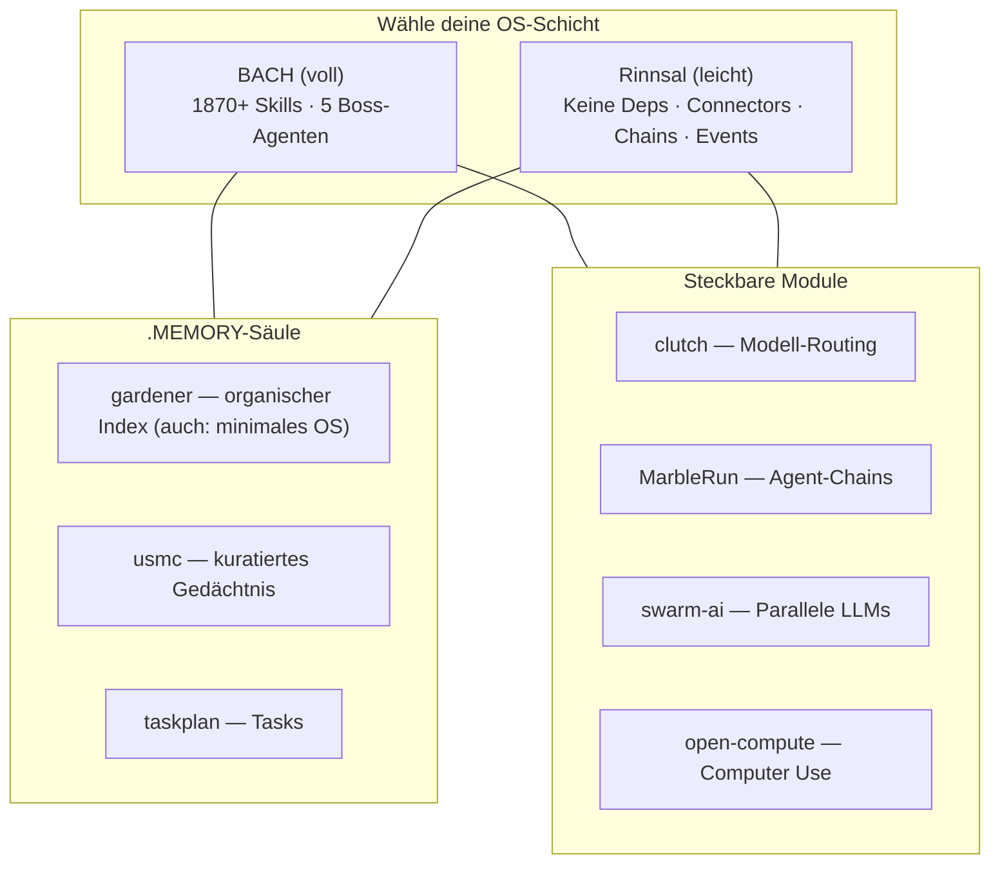

  

<h3 align="center">Extra Large Language Model Operating Systems</h3>

<i>Von der Quelle zum Strom — LLM-Betriebssysteme, die fließen.</i>

<b>🇬🇧 <a href="README.md">English Version</a></b> (maßgeblich)

> **Hinweis:** Die englische Version dieser Seite ist die maßgebliche Referenz. Diese deutsche Übersetzung kann veraltet sein. Im Zweifelsfall gilt die [englische Version](README.md).

**ellmos** (XLLM-OS) ist eine Familie textbasierter Betriebssysteme, die Large Language Models befähigen, autonom zu arbeiten, zu lernen und sich selbst zu organisieren. Für maschinenlesbaren Ökosystem-Kontext siehe **[llms.txt](https://github.com/ellmos-ai/.github/blob/master/llms.txt)**.

## Öffentliches Repository-Verzeichnis

Dieses Verzeichnis ist vollständig für die öffentlichen `ellmos-ai`-Repositories (38 Repos, davon 1 archiviert). Archivierte Repositories sind ausdrücklich markiert. Zuletzt mit GitHub abgeglichen: 2026-07-24.

| Bereich | Repositories |
|---|---|
| Organisationsprofil | **[.github](https://github.com/ellmos-ai/.github)** - Org-Profil, Community-Health-Dateien und `llms.txt` |
| Stack-Katalog | **[stacks](https://github.com/ellmos-ai/stacks)** - Katalog und gemeinsames Manifest-Schema für jeden Stack der ellmos-ai-Familie |
| Betriebssysteme | **[bach](https://github.com/ellmos-ai/bach)**, **[rinnsal](https://github.com/ellmos-ai/rinnsal)**, **[ellmos](https://github.com/ellmos-ai/ellmos)** - dazu **[gardener](https://github.com/ellmos-ai/gardener)** als minimale OS-Stufe im eigenständigen Betrieb; verzeichnet ist es unter [Die .MEMORY-Säule](#die-memory-säule) unten |
| Gedächtnis-Säule | **[usmc](https://github.com/ellmos-ai/usmc)**, **[gardener](https://github.com/ellmos-ai/gardener)**, **[taskplan](https://github.com/ellmos-ai/taskplan)** - kuratiertes Session-Gedächtnis, organischer Cross-Source-Index und Task-Tracking; siehe [Die .MEMORY-Säule](#die-memory-säule) |
| MCP-Server | **[ellmos-codecommander-mcp](https://github.com/ellmos-ai/ellmos-codecommander-mcp)**, **[ellmos-filecommander-mcp](https://github.com/ellmos-ai/ellmos-filecommander-mcp)**, **[ellmos-clatcher-mcp](https://github.com/ellmos-ai/ellmos-clatcher-mcp)**, **[n8n-manager-mcp](https://github.com/ellmos-ai/n8n-manager-mcp)**, **[ellmos-controlcenter-mcp](https://github.com/ellmos-ai/ellmos-controlcenter-mcp)**, **[ellmos-homebase-mcp](https://github.com/ellmos-ai/ellmos-homebase-mcp)**, **[ellmos-servercommander-mcp](https://github.com/ellmos-ai/ellmos-servercommander-mcp)**, **[ellmos-blender-use-mcp](https://github.com/ellmos-ai/ellmos-blender-use-mcp)**, **[open-compute-mcp](https://github.com/ellmos-ai/open-compute-mcp)** |
| Agenten-Module und Orchestrierung | **[clutch](https://github.com/ellmos-ai/clutch)**, **[connectors](https://github.com/ellmos-ai/connectors)**, **[MarbleRun](https://github.com/ellmos-ai/MarbleRun)**, **[swarm-ai](https://github.com/ellmos-ai/swarm-ai)**, **[n8n-workflow-manager](https://github.com/ellmos-ai/n8n-workflow-manager)**, **[ellmos-stack](https://github.com/ellmos-ai/ellmos-stack)**, **[agent-ops-stack](https://github.com/ellmos-ai/agent-ops-stack)**, **[skills](https://github.com/ellmos-ai/skills)**, **[build-your-users-mind](https://github.com/ellmos-ai/build-your-users-mind)**, **[open-compute](https://github.com/ellmos-ai/open-compute)**, **[web-scraper](https://github.com/ellmos-ai/web-scraper)** - eigenständiger, aus BACH extrahierter Web-Scraper (get/links/forms/headers/extract/screenshot) mit SSRF-Schutz; **[anonymizer](https://github.com/ellmos-ai/anonymizer)** - lokale Dokument-Pseudonymisierung mit fail-closed NER; **[report-forge](https://github.com/ellmos-ai/report-forge)** - domänenneutraler Kern für anonymisierbare Berichts-Pipelines |
| Fachanwendungen | **[law-checker](https://github.com/ellmos-ai/law-checker)** - quellenbasierte KI-Ersteinschätzungen für deutsches Recht (Erstorientierung, kein Anwaltsersatz), Gesetzes-Registry und Verkörperungs-Agenten; **[worksheet-generator](https://github.com/ellmos-ai/worksheet-generator)** - erzeugt strukturierte, ICF-gestützte Arbeitsblätter für pädagogische und therapeutische Zwecke, gerendert nach Markdown/HTML/DOCX; **[steuer-assistent](https://github.com/ellmos-ai/steuer-assistent)** - offline-first Arbeitsblatt für Werbungskosten von Arbeitnehmern: geführte Erfassung, Plausibilitätsprüfungen, kein Cloud-Upload |
| Medien- und Content-Workflows | **[ai-media-editor](https://github.com/ellmos-ai/ai-media-editor)** - lokaler AI-Video-, Audio- und Podcast-Editor mit lokaler Transkription, transkriptbasierten Schnitten, Hyperframes-Bewegtgrafik und agentengesteuerten kreativen Edits |
| Evaluation, Vorlagen und Wartung | **[ellmos-tests](https://github.com/ellmos-ai/ellmos-tests)**, **[project-docs-template](https://github.com/ellmos-ai/project-docs-template)** - agentenfreundliche Projektdokumentationsvorlage mit START/STATE/TODO/DONE, Workflows, leichtem Tooling und LLM-freundlichem Projektgedächtnis; **[clirec](https://github.com/ellmos-ai/clirec)** - menschenlesbare GUI-Demo-Aufzeichnungen für CLI- und Agenten-Workflows |
| Legacy-Archiv | **[recludos-legacy](https://github.com/ellmos-ai/recludos-legacy)** - archivierter Vorgänger von BACH |

## Die ellmos-Familie

Zwei Betriebssysteme — verschiedene Philosophien, selbes Ziel — plus eine Gedächtnis-Säule, in die sich beide einklinken können:

<table>
<tr>
<td align="center" width="33%">
 
<b><a href="https://github.com/ellmos-ai/bach">BACH</a></b> 
<i>Der Strom der alles vereint</i> 
Volles LLM-OS: 113+ Handler, 1870+ Skills, Agenten, GUI
</td>
<td align="center" width="33%">
 
<b><a href="https://github.com/ellmos-ai/rinnsal">Rinnsal</a></b> 
<i>Das Rinnsal</i> 
Leichtgewichtige LLM-Infrastruktur: Memory, Tasks, Connectors, Chains. Keine Abhängigkeiten.
</td>
<td align="center" width="33%">
 
<b><a href="https://github.com/ellmos-ai/gardener">gardener</a></b> 
<i>Der Zen-Garten</i> 
Zwei gleichrangige Rollen: das <b>Gedächtnis-Modul</b> von ellmos (organischer Cross-Source-Index), sobald es in die Säule komponiert wird — und ein minimalistisches, LLM-natives <b>OS</b>, wenn es eigenständig läuft: 1 Tabelle, 4 Funktionen, FTS5-Suche.
</td>
</tr>
</table>

Welche Rolle greift, ist eine Frage des Einsatzes, keine Rangordnung: in die [.MEMORY-Säule](#die-memory-säule) unten komponiert, ist gardener deren organischer Cross-Source-Index; eigenständig betrieben, ist es die minimale OS-Stufe. Beides wird vollständig unterstützt.

## Die .MEMORY-Säule

ellmos-Gedächtnis ist nicht ein Repo, sondern drei fokussierte Module, die sich zum Standard-Gedächtnisstack der Familie zusammenfügen — importierbar als Abhängigkeit von jeder OS-Schicht (BACH, Rinnsal), statt dass jede ihr eigenes Memory-/Task-System baut:

| Modul | Rolle |
|---|---|
| **[usmc](https://github.com/ellmos-ai/usmc)** | Kuratiertes Session-/Kern-Gedächtnis — die **Fassade und der Einstiegspunkt** des Gedächtnissystems. Push-Modell: „was ich bewusst merke". |
| **[gardener](https://github.com/ellmos-ai/gardener)** | Gedächtnis-**Zulieferer**: organisches Wachstum via absorb/decay, plus ein föderierter Cross-Source-FTS5-Index über `observe()`, der Treffer zur Quelle zurückzitiert. Pull-Modell: „indexieren, was ohnehin da ist". |
| **[taskplan](https://github.com/ellmos-ai/taskplan)** | Eigenständiges SQLite-Task-Modul — Tasks bleiben vom Wissens-Gedächtnis getrennt. Keine Abhängigkeiten. |

## Architektur: OS-Schichten, Gedächtnis-Säule & steckbare Module

Das ellmos-Ökosystem besteht aus **Betriebssystemen**, der **.MEMORY-Säule** und **steckbaren Modulen**, die in jedes OS integriert — oder eigenständig genutzt werden können.

### Betriebssysteme

| | **BACH** | **Rinnsal** | **gardener** *(eigenständig als OS, komponiert als Gedächtnis-Modul)* |
|---|---|---|---|
| **Philosophie** | Maximalistisch: alles integriert | Leichtgewichtig: keine Abhängigkeiten | Minimalistisch: 1 Tabelle, 4 Funktionen |
| **Datenbank** | SQLite (145+ Tabellen) | SQLite (strukturiert) | SQLite (1 Tabelle `everything` + FTS5) |
| **Memory** | 5-Typen kognitives Modell | Facts/Notes/Lessons/Sessions | Vereinheitlicht (memo/lesson/recall + Decay) |
| **Tasks** | Volles GTD (Priorität, Deadline, Tags) | Priorität + Status + Agent-Zuweisung | type='task' in everything |
| **Tools** | 550+ spezialisierte Tools | CLI-Befehle | 6 Bridge+Skin-Tools (erweiterbar) |
| **Skills/Agenten** | 1870+ Skills, 5 Boss-Agenten, 28 Experten | Keine | Keine (das LLM ist der Agent) |
| **Connectors** | Telegram, E-Mail, WhatsApp | Telegram, Discord, Home Assistant | Geplant (v0.2+) |
| **GUI** | PySide6 Desktop + Web | Nur CLI | Nur CLI |
| **Selbsterweiterung** | `bach skills create` | Nein | Nein |
| **Codebasis** | ~50.000+ Zeilen | ~2.000 Zeilen | ~1.600 Zeilen |
| **Ideal für** | Power-User, All-in-one | Entwickler die leichte Infra wollen | Minimalisten, LLM-native Experimente; eigenständige Nutzung der .MEMORY-Säule |

### Steckbare Module & Skills

Diese Module und Skills können in jedes OS integriert oder eigenständig genutzt werden:

<table>
<tr>
<td valign="top" width="55%">

**Module**

*(USMC, gardener und taskplan leben jetzt in der [.MEMORY-Säule](#die-memory-säule) oben.)*

| Modul | Zweck |
|---|---|
| **[clutch](https://github.com/ellmos-ai/clutch)** | Anbieter-neutrales Modell-Routing |
| **[connectors](https://github.com/ellmos-ai/connectors)** | Portable Messaging-Connectors für AI-Agenten: Telegram, Discord, Signal, WhatsApp, Home Assistant und Webhook |
| **[MarbleRun](https://github.com/ellmos-ai/MarbleRun)** | Chain-Orchestrierung |
| **[swarm-ai](https://github.com/ellmos-ai/swarm-ai)** | Parallele LLM-Koordination |
| **[build-your-users-mind](https://github.com/ellmos-ai/build-your-users-mind)** | Nutzer-Modellierung und Theory-of-Mind-Rezept für persönliche Entscheidungsavatare aus Interaktionslogs |
| **[open-compute](https://github.com/ellmos-ai/open-compute)** | Modellagnostischer Computer-Use-Kern für Claude, OpenAI CUA und Mock-Backends mit normalisierten Koordinaten, kanonischem Action-Schema und zentralem Safety-Gate |
| **[web-scraper](https://github.com/ellmos-ai/web-scraper)** | Eigenständiger, aus BACH extrahierter Web-Scraper — get/links/forms/headers/extract/screenshot, mit SSRF-Schutz |
| **[project-docs-template](https://github.com/ellmos-ai/project-docs-template)** | Agentenfreundliche Projektdokumentationsvorlage mit START/STATE/TODO/DONE, Workflows, leichten Checks und LLM-freundlichem Projektgedächtnis |
| **[anonymizer](https://github.com/ellmos-ai/anonymizer)** | Lokale Dokument-Pseudonymisierung: fail-closed NER, authentifizierte Schlüsselverschlüsselung, Alles-oder-nichts-Veröffentlichungsvertrag |
| **[report-forge](https://github.com/ellmos-ai/report-forge)** | Domänenneutraler Kern für anonymisierbare Berichts-Pipelines: Quellen extrahieren, schemagebundenen LLM-Prompt bauen, Word-Vorlage befüllen |

</td>
<td valign="top" width="45%" align="center">

**Skills**

 
<b><a href="https://github.com/ellmos-ai/skills">skills</a></b> 
<i>Steckbare Skill-Bibliothek</i> 
Wiederverwendbare Agenten-Skills die sich in jedes ellmos-OS einfügen. 
Entwicklung, Forschung, Bildung, Infrastruktur &mdash; nimm was du brauchst.

</td>
</tr>
</table>

### Medien- und Content-Workflows

| Projekt | Zweck |
|---|---|
| **[ai-media-editor](https://github.com/ellmos-ai/ai-media-editor)** | Lokaler AI-Medien-Editor für Video, Audio und Podcasts: lokale Spracherkennung mit faster-whisper oder WhisperX, Scribe-kompatibles Transcript-JSON, video-use-Schnittlogik, Hyperframes-Bewegtgrafik und agentengeführte kreative Edits. |

### Wie alles zusammenpasst

Alle Projekte: **Python 3.10+** | **SQLite** | **MIT-Lizenz** | **Keine oder minimale Abhängigkeiten**

---

## Stacks

Stacks sind manifestgesteuerte Kompositionen (`ellmos.stack.v2`) — keine Code-Kopien, sondern deklarierte Komponenten. Zwei aktive öffentliche Stacks bilden den Kern der Familie, katalogisiert in einem dritten:

| Stack | Zweck | Kernmodule |
|---|---|---|
| **[stacks](https://github.com/ellmos-ai/stacks)** | Katalog und gemeinsames Manifest-Schema für jeden Stack der ellmos-ai-Familie | — |
| **[ellmos-stack](https://github.com/ellmos-ai/ellmos-stack)** | Selbstgehostete, lokale KI-Forschungsbasis: Ollama, n8n, Rinnsal-Memory, Docker-Compose-Automatisierung | Rinnsal · **[KnowledgeDigest](https://github.com/file-bricks/knowledgedigest)** (file-bricks) · Ollama · n8n |
| **[agent-ops-stack](https://github.com/ellmos-ai/agent-ops-stack)** | Koordinationsschicht für CLI-Coding-Agenten: Ticket-Routing, Datei-Locking, maschinenübergreifende Synchronisation, Entscheidungs-Avatar, MCP-Control-Plane | **[ticket-master](https://github.com/dev-bricks/ticket-master)** (dev-bricks) · **[lock-master](https://github.com/dev-bricks/lock-master)** (dev-bricks) · **[sync-master](https://github.com/dev-bricks/sync-master)** (dev-bricks) · [build-your-users-mind](https://github.com/ellmos-ai/build-your-users-mind) · [skills](https://github.com/ellmos-ai/skills) · ellmos-controlcenter-mcp · ellmos-homebase-mcp |

Etliche dieser Module sind bewusst **beides**: eigenständige Dev-Tools, die man einzeln nutzen kann, und Stack-Komponenten, die man automatisch mit der Stack-Installation erhält. Das gilt auch für **[llm-note](https://github.com/doc-bricks/llm-note)** (doc-bricks) — lokale Notizbücher für LLM-Agenten, gebaut als steckbares Modul für Stack-Kompositionen.

---

## MCP-Server

<table>
<tr>
<td align="center" width="25%">
 
<b><a href="https://github.com/ellmos-ai/ellmos-codecommander-mcp">CodeCommander</a></b> 
Code-Analyse & Refactoring 
<code>npm i -g ellmos-codecommander-mcp</code>
</td>
<td align="center" width="25%">
 
<b><a href="https://github.com/ellmos-ai/ellmos-filecommander-mcp">FileCommander</a></b> 
Dateiverwaltung & Batch-Operationen 
<code>npm i -g ellmos-filecommander-mcp</code>
</td>
<td align="center" width="25%">
 
<b><a href="https://github.com/ellmos-ai/ellmos-clatcher-mcp">Clatcher</a></b> 
Hilfswerkzeuge: Dateireparatur, Formatkonvertierung, Duplikaterkennung, Batch-Operationen 
<code>npm i -g ellmos-clatcher-mcp</code>
</td>
<td align="center" width="25%">
 
<b><a href="https://github.com/ellmos-ai/n8n-manager-mcp">n8n Manager</a></b> 
n8n Workflow-Automatisierung 
<code>npm i -g n8n-manager-mcp</code>
</td>
</tr>
<tr>
<td align="center" width="25%">
 
<b><a href="https://github.com/ellmos-ai/ellmos-controlcenter-mcp">ControlCenter</a></b> 
MCP-Profil-Dashboard, Fähigkeits-Bundles & Rechte-Audits 
<code>npm i -g ellmos-controlcenter-mcp</code>
</td>
<td align="center" width="25%">
 
<b><a href="https://github.com/ellmos-ai/ellmos-homebase-mcp">Homebase</a></b> 
Lokales LLM-Memory, Wissen, State & Orchestrierung 
<code>npm i -g ellmos-homebase-mcp</code>
</td>
<td align="center" width="25%">
 
<b><a href="https://github.com/ellmos-ai/ellmos-servercommander-mcp">ServerCommander</a></b> 
Server-Health-Checks, Log-Analyse, Deploy-Dry-runs & Mail-Status 
<code>npm i -g ellmos-servercommander-mcp</code>
</td>
<td align="center" width="25%">
 
<b><a href="https://github.com/ellmos-ai/ellmos-blender-use-mcp">Blender Use</a></b> 
Headless Blender-Asset-QA: Background-Läufe & FBX-Reimport-Prüfungen 
<code>npm i -g ellmos-blender-use-mcp</code>
</td>
</tr>
<tr>
<td align="center" width="25%">
 
<b><a href="https://github.com/ellmos-ai/open-compute-mcp">open-compute-mcp</a></b> 
Computer-Use: Screenshot, safety-gated Aktionen & Windows-UIA-Zielen 
<code>npx open-compute-mcp</code>
</td>
</tr>
</table>

## Legacy

<table>
<tr>
<td align="center" width="100%">
 
<b><a href="https://github.com/ellmos-ai/recludos-legacy">recludOS</a></b> 
<i>Archivierter Vorgänger von BACH</i> 
Historische Referenz
</td>
</tr>
</table>

---

## Verwandte Projekte in anderen Orgs

Diese Projekte liegen in Schwester-Organisationen, sind aber besonders relevant für das ellmos-Multi-Agenten-Ökosystem:

| Projekt | Org | Beschreibung |
|---|---|---|
| **[ticket-master](https://github.com/dev-bricks/ticket-master)** | dev-bricks | Cross-platform-Ticket-Router und Triage-Konsole — strukturiert Tickets und leitet sie an den passenden KI-Anbieter oder Sub-Agenten weiter |
| **[lock-master](https://github.com/dev-bricks/lock-master)** | dev-bricks | Portables Multi-Agenten-Dateisperr-System — LOCK*.txt-basiertes Projekt-/Komponenten-Locking mit Scopes, Ablaufzeit, Stale-Cleanup und schnellem Übersichts-Cache; besonders relevant für Multi-Agenten-Koordination |
| **[sync-master](https://github.com/dev-bricks/sync-master)** | dev-bricks | Serverloser Cross-Machine-Sync-Yard für Multi-Agenten-Setups — ein Schreib-Slot pro Rechner, getaktetes Tagesritual, Nachrichtenkanäle und Bootstrap-Runbook; die Transportschicht, die mehrere Rechner und ihre Agenten synchron hält |
| **[companion-for-agy](https://github.com/dev-bricks/companion-for-agy)** | dev-bricks | PTY-Wrapper, der agy-Antworten (Gemini CLI) über ANSI-Farb-Extraktion einfängt — macht Gemini-Ausgaben für Claude Code, Codex und CI-Pipelines zuverlässig lesbar |
| **[llm-note](https://github.com/doc-bricks/llm-note)** | doc-bricks | Lokale Notizen und Notizbücher für LLM-Agenten — aus BACH-Notizblock-/Denkarium-Mustern extrahiert, mit SQLite, Klartext-Notizbüchern und sechs Sprachen |
| **[knowledgedigest](https://github.com/file-bricks/knowledgedigest)** | file-bricks | Lokale Wissensdatenbank mit LLM-Vorverarbeitung — Dokumente ohne Cloud-Abhängigkeiten einlesen, strukturieren und abfragen; Kernmodul von [ellmos-stack](https://github.com/ellmos-ai/ellmos-stack) |

---

**[Vollständige Dokumentation](https://github.com/ellmos-ai/ellmos)** | **Lizenz:** MIT
