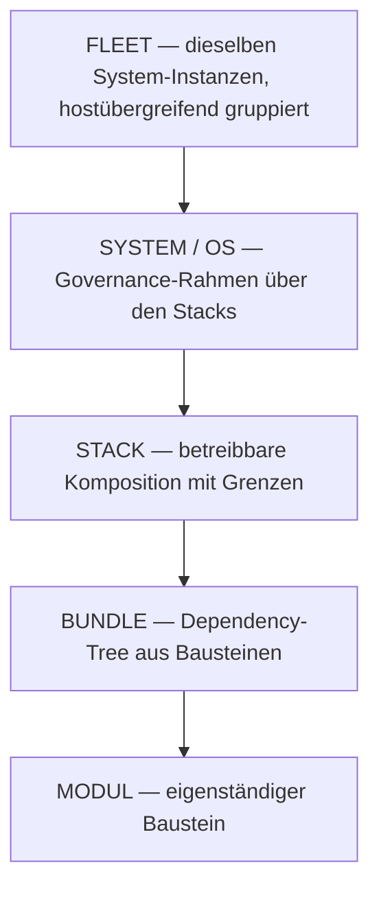

  

> **Hinweis:** Die englische Version dieser Seite ist die maßgebliche Referenz. Diese deutsche Übersetzung kann veraltet sein. Im Zweifelsfall gilt die [englische Version](README.md).

> [!NOTE]
> **Ökosystem & Maschinen-Index:** Für maschinenlesbaren Kontext, Agent-Kontext-Laden und vollständige Repository-Orchestrierung siehe **[llms.txt](https://github.com/ellmos-ai/.github/blob/master/llms.txt)**. Alle aktiven Software-Projekte in der ellmos-ai Organisation arbeiten nach Local-First-Prinzipien mit SQLite-Persistenz, minimalen externen Abhängigkeiten und transparenter Komponenten-Struktur.

**ellmos** (XLLM-OS) ist eine Familie textbasierter Betriebssysteme, die Large Language Models befähigen, autonom zu arbeiten, zu lernen und sich selbst zu organisieren.

## Öffentliches Repository-Verzeichnis

Dieses Verzeichnis ist vollständig für die öffentlichen `ellmos-ai`-Repositories (48 Repos, davon 1 archiviert). Archivierte Repositories sind ausdrücklich markiert. Zuletzt mit GitHub abgeglichen: 2026-07-31.

| Bereich | Repositories |
|---|---|
| Organisationsprofil | **[.github](https://github.com/ellmos-ai/.github)** - Org-Profil, Community-Health-Dateien und `llms.txt` |
| Stack-Katalog | **[stacks](https://github.com/ellmos-ai/stacks)** - Katalog und gemeinsames Manifest-Schema für jeden Stack der ellmos-ai-Familie |
| Betriebssysteme | **[bach](https://github.com/ellmos-ai/bach)**, **[rinnsal](https://github.com/ellmos-ai/rinnsal)**, **[ellmos](https://github.com/ellmos-ai/ellmos)** - dazu **[gardener](https://github.com/ellmos-ai/gardener)** als minimale OS-Stufe im eigenständigen Betrieb; verzeichnet ist es unter [Memory und Kontrolle](#memory-and-control) unten |
| Gedächtnis-Säule | **[usmc](https://github.com/ellmos-ai/usmc)**, **[gardener](https://github.com/ellmos-ai/gardener)**, **[task-master](https://github.com/ellmos-ai/task-master)** - kuratiertes Session-Gedächtnis, organischer Cross-Source-Index und Task-Tracking; siehe [Memory und Kontrolle](#memory-and-control) |
| MCP-Server | **[ellmos-codecommander-mcp](https://github.com/ellmos-ai/ellmos-codecommander-mcp)**, **[ellmos-filecommander-mcp](https://github.com/ellmos-ai/ellmos-filecommander-mcp)**, **[ellmos-clatcher-mcp](https://github.com/ellmos-ai/ellmos-clatcher-mcp)**, **[n8n-manager-mcp](https://github.com/ellmos-ai/n8n-manager-mcp)**, **[ellmos-controlcenter-mcp](https://github.com/ellmos-ai/ellmos-controlcenter-mcp)**, **[ellmos-homebase-mcp](https://github.com/ellmos-ai/ellmos-homebase-mcp)**, **[ellmos-servercommander-mcp](https://github.com/ellmos-ai/ellmos-servercommander-mcp)**, **[ellmos-blender-use-mcp](https://github.com/ellmos-ai/ellmos-blender-use-mcp)**, **[open-compute-mcp](https://github.com/ellmos-ai/open-compute-mcp)** |
| Agenten-Module und Orchestrierung | **[clutch](https://github.com/ellmos-ai/clutch)**, **[connectors](https://github.com/ellmos-ai/connectors)**, **[MarbleRun](https://github.com/ellmos-ai/MarbleRun)**, **[swarm-ai](https://github.com/ellmos-ai/swarm-ai)**, **[n8n-workflow-manager](https://github.com/ellmos-ai/n8n-workflow-manager)**, **[ellmos-stack](https://github.com/ellmos-ai/ellmos-stack)**, **[agent-ops-stack](https://github.com/ellmos-ai/agent-ops-stack)**, **[skills](https://github.com/ellmos-ai/skills)**, **[build-your-users-mind](https://github.com/ellmos-ai/build-your-users-mind)**, **[open-compute](https://github.com/ellmos-ai/open-compute)**, **[web-scraper](https://github.com/ellmos-ai/web-scraper)** - eigenständiger, aus BACH extrahierter Web-Scraper (get/links/forms/headers/extract/screenshot) mit SSRF-Schutz; **[anonymizer](https://github.com/ellmos-ai/anonymizer)** - lokale Dokument-Pseudonymisierung mit fail-closed NER; **[report-forge](https://github.com/ellmos-ai/report-forge)** - domänenneutraler Kern für anonymisierbare Berichts-Pipelines |
| Agenten-Hooks, Evidenz und Koordination | **[memoryhooker](https://github.com/ellmos-ai/memoryhooker)** - verbindet lokale Gedächtnisquellen mit Coding-Agent-Lifecycle-Hooks (kein Netzwerk); **[workflowhooker](https://github.com/ellmos-ai/workflowhooker)** - konfigurierbare Workflow-Prüfungen an Agent-Lifecycle-Events, null Abhängigkeiten; **[memoryhooker-provenance](https://github.com/ellmos-ai/memoryhooker-provenance)** / **[workflowhooker-provenance](https://github.com/ellmos-ai/workflowhooker-provenance)** - Provenance-Varianten; **[prompt-evidence-collector](https://github.com/ellmos-ai/prompt-evidence-collector)** - lokaler Prompt-/Workflow-Evidenz-Speicher (aus ellmos-core extrahiert); **[roshambo](https://github.com/ellmos-ai/roshambo)** - Multi-Agenten-Koordinator: serialisierbare Leases + Outcome-Gedächtnis auf CockroachDB; **[roshambo-starmap](https://github.com/ellmos-ai/roshambo-starmap)** - gemeinsame Himmelskarte zu roshambo |
| Kern- und System-Infrastruktur | **[ellmos-core](https://github.com/ellmos-ai/ellmos-core)** - Core/Shell + Web-UI für ellmos Sovereign (private Alpha); **[ellmos-development-system](https://github.com/ellmos-ai/ellmos-development-system)** - private Kompositions-Rezepte und Entwicklungssystem-Manifeste; **[policy-registry](https://github.com/ellmos-ai/policy-registry)** - Policy-Registry-Modul; **[system-explorer](https://github.com/ellmos-ai/system-explorer)** - System-Exploration-Werkzeuge |
| Fachanwendungen | **[law-checker](https://github.com/ellmos-ai/law-checker)** - quellenbasierte KI-Ersteinschätzungen für deutsches Recht (Erstorientierung, kein Anwaltsersatz), Gesetzes-Registry und Verkörperungs-Agenten; **[worksheet-generator](https://github.com/ellmos-ai/worksheet-generator)** - erzeugt strukturierte, ICF-gestützte Arbeitsblätter für pädagogische und therapeutische Zwecke, gerendert nach Markdown/HTML/DOCX; **[steuer-assistent](https://github.com/ellmos-ai/steuer-assistent)** - offline-first Arbeitsblatt für Werbungskosten von Arbeitnehmern: geführte Erfassung, Plausibilitätsprüfungen, kein Cloud-Upload |
| Medien- und Content-Workflows | **[ai-media-editor](https://github.com/ellmos-ai/ai-media-editor)** - lokaler AI-Video-, Audio- und Podcast-Editor mit lokaler Transkription, transkriptbasierten Schnitten, Hyperframes-Bewegtgrafik und agentengesteuerten kreativen Edits |
| Evaluation, Vorlagen und Wartung | **[ellmos-tests](https://github.com/ellmos-ai/ellmos-tests)**, **[project-docs-template](https://github.com/ellmos-ai/project-docs-template)** - agentenfreundliche Projektdokumentationsvorlage mit START/STATE/TODO/DONE, Workflows, leichtem Tooling und LLM-freundlichem Projektgedächtnis; **[clirec](https://github.com/ellmos-ai/clirec)** - menschenlesbare GUI-Demo-Aufzeichnungen für CLI- und Agenten-Workflows |
| Legacy-Archiv | **[recludos-legacy](https://github.com/ellmos-ai/recludos-legacy)** - archivierter Vorgänger von BACH |

---

## Skills

  

---

## Module

Unsere Empfehlungen — Bausteine, die sich in jedes ellmos-OS einfügen oder allein stehen. Die Banner sind die Links; Details in der Tabelle darunter:

| Modul | Fokus |
|---|---|
| **[swarm-ai](https://github.com/ellmos-ai/swarm-ai)** | Parallele LLM-Koordination |
| **[build-your-users-mind](https://github.com/ellmos-ai/build-your-users-mind)** | Nutzer-Theory-of-Mind: Entscheidungsavatare aus Interaktionslogs |
| **[web-scraper](https://github.com/ellmos-ai/web-scraper)** | Fetchen, extrahieren, strukturieren — eigenständiger Scraper mit SSRF-Schutz |
| **[report-forge](https://github.com/ellmos-ai/report-forge)** | Domänenneutraler Kern für anonymisierbare Berichts-Pipelines |
| **[ai-media-editor](https://github.com/ellmos-ai/ai-media-editor)** | Lokaler AI-Video-, Audio- und Podcast-Editor mit transkriptbasierten Schnitten |
| **[clutch](https://github.com/ellmos-ai/clutch)** | Anbieter-neutrales Modell-Routing |
| **[MarbleRun](https://github.com/ellmos-ai/MarbleRun)** | Chain-Orchestrierung |
| **[n8n-workflow-manager](https://github.com/ellmos-ai/n8n-workflow-manager)** | Lokale n8n-Verwaltung |
| **[open-compute](https://github.com/ellmos-ai/open-compute)** | Computer-Use-Kern mit Safety-Gate |
| **[connectors](https://github.com/ellmos-ai/connectors)** | Portable Messaging-Connectors & CLI-Agent-Bridge |

Weitere Module, noch ohne eigenes Artwork: **[anonymizer](https://github.com/ellmos-ai/anonymizer)** (Dokument-Pseudonymisierung mit fail-closed NER) · **[project-docs-template](https://github.com/ellmos-ai/project-docs-template)** (agentenfreundliche Projektdokumentation)

---

## Bundles

Bundles deklarieren *welche Modulversionen zusammengehören*: versionierte, kompatibilitätsgeprüfte Dependency-Trees.

Unsere ersten Bundle-Manifeste sind registriert, aber noch **rein deklarativ** (Draft-Lebenszyklus, keine Laufzeit-Autorität) — darum ist diese Sektion eine Vorschau. Erster öffentlicher Kandidat: das .MEMORY-Säulen-Set `usmc + gardener + task-master`.

**Coming soon.**

---

## Das Kompositionsmodell — Build Your Stack

Ein Gedanke zieht sich durch das gesamte Ökosystem: **Module ergeben komponiert etwas Neues.** Such dir die Bausteine, die du brauchst, verdrahte sie auf deine Weise — heraus kommt dein eigener Stack, keine fest vorgegebene Produktedition.

| Ebene | Definition | Öffentliches Beispiel |
|---|---|---|
| **Modul** | Ein Baustein: eine eigenständige Fähigkeit, unabhängig versioniert und für sich allein nützlich. | [gardener](https://github.com/ellmos-ai/gardener), [clutch](https://github.com/ellmos-ai/clutch), jeder [MCP-Server](#mcp-servers) |
| **Bundle** | Der Dependency-Tree aus Bausteinen — deklariert *was zusammengehört*, als versionierte, kompatibilitätsgeprüfte Menge. | Das .MEMORY-Säulen-Set: usmc + gardener + task-master ([Memory und Kontrolle](#memory-and-control)) |
| **Stack** | Eine betreibbare Komposition mit Grenzen — deklariert *wie es zusammenläuft*: Daten, Netz, Mandanten, Ausführung. Größenklassen: `bundle`, `core`, `full`, `os-stack`. | [ellmos-stack](https://github.com/ellmos-ai/ellmos-stack), [agent-ops-stack](https://github.com/ellmos-ai/agent-ops-stack) |
| **System / OS** | Der Governance-Rahmen über den Stacks: Policies, Identität und Lebenszyklus für eine Installation oder Edition. | [bach](https://github.com/ellmos-ai/bach), [rinnsal](https://github.com/ellmos-ai/rinnsal), [ellmos](https://github.com/ellmos-ai/ellmos) |
| **Fleet** | Die Multi-Host-Gruppierung derselben System-Instanzen — ein System, viele Maschinen, synchron gehalten. | [roshambo](https://github.com/ellmos-ai/roshambo) mit [sync-master](https://github.com/dev-bricks/sync-master) |

**Skills spielen auf allen Ebenen eine Rolle**: Sie werden als steckbare Module ausgeliefert, in Bundles versioniert, in Stacks verdrahtet und von Systemen ihren Agenten bereitgestellt — eine Skill-Bibliothek, nützlich vom einzelnen Modul bis zur ganzen Fleet.

Stacks deklarieren Komposition, statt Modul-Code zu kopieren — darum lässt sich jede Komposition zu etwas Neuem umverdrahten. Ein „Control Room" für den Betrieb ist etwa kein eigenes Produkt, sondern ein Stack, der die vorhandenen MCP-Zugangsflächen ([ControlCenter](https://github.com/ellmos-ai/ellmos-controlcenter-mcp), [ServerCommander](https://github.com/ellmos-ai/ellmos-servercommander-mcp), [Homebase](https://github.com/ellmos-ai/ellmos-homebase-mcp)) zu einer gemeinsamen Betriebssicht verbindet. Gleiche Module, neues Ganzes.

---

## Unsere Premium-Systeme

*more than a stack*

Manche Kompositionen wachsen über die Stack-Ebene hinaus: Sie sind governierte Systeme mit eigener Identität, Policies und Lebenszyklus. Zwei davon sind öffentlich — die Banner sind die Links:

| System | Was es ist |
|---|---|
| **[BACH](https://github.com/ellmos-ai/bach)** | *Der Strom, der alles vereint*: das volle LLM-OS mit 113+ Handlern, 1870+ Skills, Boss-Agenten und GUI. |
| **[Rinnsal](https://github.com/ellmos-ai/rinnsal)** | *Das Rinnsal*: leichtgewichtige LLM-Infrastruktur — Memory, Tasks, Connectors, Chains, i18n. Keine Abhängigkeiten. |

Verschiedene Philosophien, selbes Ziel — und [gardener](https://github.com/ellmos-ai/gardener) ist im eigenständigen Betrieb zugleich die minimale OS-Stufe (siehe [Memory und Kontrolle](#memory-and-control)).

---

## Stacks

Stacks sind manifestgesteuerte Kompositionen (`ellmos.stack.v2`) — keine Code-Kopien, sondern deklarierte Komponenten. Zwei aktive öffentliche Stacks bilden den Kern der Familie, katalogisiert in einem dritten:

| Stack | Zweck | Kernmodule |
|---|---|---|
| **[stacks](https://github.com/ellmos-ai/stacks)** | Katalog und gemeinsames Manifest-Schema für jeden Stack der ellmos-ai-Familie | — |
| **[ellmos-stack](https://github.com/ellmos-ai/ellmos-stack)** | Selbstgehostete, lokale KI-Forschungsbasis: Ollama, n8n, Rinnsal-Memory, Docker-Compose-Automatisierung | Rinnsal · **[KnowledgeDigest](https://github.com/file-bricks/knowledgedigest)** (file-bricks) · Ollama · n8n |
| **[agent-ops-stack](https://github.com/ellmos-ai/agent-ops-stack)** | Koordinationsschicht für CLI-Coding-Agenten: Ticket-Routing, Datei-Locking, maschinenübergreifende Synchronisation, Entscheidungs-Avatar, MCP-Control-Plane | **[ticket-master](https://github.com/dev-bricks/ticket-master)** (dev-bricks) · **[lock-master](https://github.com/dev-bricks/lock-master)** (dev-bricks) · **[sync-master](https://github.com/dev-bricks/sync-master)** (dev-bricks) · [build-your-users-mind](https://github.com/ellmos-ai/build-your-users-mind) · [skills](https://github.com/ellmos-ai/skills) · ellmos-controlcenter-mcp · ellmos-homebase-mcp |

Etliche dieser Module sind bewusst **beides**: eigenständige Dev-Tools, die man einzeln nutzen kann, und Stack-Komponenten, die man automatisch mit der Stack-Installation erhält. Das gilt auch für **[llm-note](https://github.com/doc-bricks/llm-note)** (doc-bricks) — lokale Notizbücher für LLM-Agenten, gebaut als steckbares Modul für Stack-Kompositionen.

---

## MCP-Server — *Stacks that talk*

Neun MCP-Server, eine Control-Plane — arrangiert als vertikaler **Stammbaum (bottom-up)**: **Wurzel & Stamm unten** (älteste Server, 2026-02), über die mittlere Infrastruktur (2026-05 bis 2026-06) nach oben verästelt zu den **jüngsten Zweigen an der Spitze** (2026-07), mit Server-Logos als Früchte an den Ästen.

  
  <map name="mcp-stammbaum-map">
    <area shape="rect" coords="81,844,279,1032" href="https://github.com/ellmos-ai/ellmos-filecommander-mcp" alt="FileCommander" title="FileCommander — #1 filecommander · 2026-02">
    <area shape="rect" coords="396,804,604,992" href="https://github.com/ellmos-ai/ellmos-codecommander-mcp" alt="CodeCommander" title="CodeCommander — #2 codecommander · 2026-02">
    <area shape="rect" coords="806,804,993,992" href="https://github.com/ellmos-ai/n8n-manager-mcp" alt="n8n Manager" title="n8n Manager — #3 n8n-manager · 2026-02">
    <area shape="rect" coords="1144,844,1296,1032" href="https://github.com/ellmos-ai/ellmos-clatcher-mcp" alt="Clatcher" title="Clatcher — #4 clatcher · 2026-03">
    <area shape="rect" coords="187,464,373,652" href="https://github.com/ellmos-ai/ellmos-controlcenter-mcp" alt="ControlCenter" title="ControlCenter — #5 controlcenter · 2026-05">
    <area shape="rect" coords="617,384,783,572" href="https://github.com/ellmos-ai/ellmos-homebase-mcp" alt="Homebase" title="Homebase — #6 homebase · 2026-06">
    <area shape="rect" coords="1012,464,1228,652" href="https://github.com/ellmos-ai/ellmos-servercommander-mcp" alt="ServerCommander" title="ServerCommander — #7 servercommander · 2026-06">
    <area shape="rect" coords="332,124,508,312" href="https://github.com/ellmos-ai/ellmos-blender-use-mcp" alt="Blender Use" title="Blender Use — #8 blender-use · 2026-07">
    <area shape="rect" coords="882,124,1077,312" href="https://github.com/ellmos-ai/open-compute-mcp" alt="open-compute" title="open-compute — #9 open-compute · 2026-07">
  </map>

| Server | Fokus | Installation |
|---|---|---|
| **[CodeCommander](https://github.com/ellmos-ai/ellmos-codecommander-mcp)** | Code-Analyse & Refactoring | `npm i -g ellmos-codecommander-mcp` |
| **[FileCommander](https://github.com/ellmos-ai/ellmos-filecommander-mcp)** | Dateiverwaltung & Batch-Operationen | `npm i -g ellmos-filecommander-mcp` |
| **[Clatcher](https://github.com/ellmos-ai/ellmos-clatcher-mcp)** | Dateireparatur, Formatkonvertierung, Duplikate | `npm i -g ellmos-clatcher-mcp` |
| **[n8n Manager](https://github.com/ellmos-ai/n8n-manager-mcp)** | n8n Workflow-Automatisierung | `npm i -g n8n-manager-mcp` |
| **[ControlCenter](https://github.com/ellmos-ai/ellmos-controlcenter-mcp)** | MCP-Profil-Dashboard, Fähigkeits-Bundles & Rechte-Audits | `npm i -g ellmos-controlcenter-mcp` |
| **[Homebase](https://github.com/ellmos-ai/ellmos-homebase-mcp)** | Lokales LLM-Memory, Wissen, State & Orchestrierung | `npm i -g ellmos-homebase-mcp` |
| **[ServerCommander](https://github.com/ellmos-ai/ellmos-servercommander-mcp)** | Server-Health-Checks, Log-Analyse, Deploy-Dry-Runs | `npm i -g ellmos-servercommander-mcp` |
| **[Blender Use](https://github.com/ellmos-ai/ellmos-blender-use-mcp)** | Headless Blender-Asset-QA | `npm i -g ellmos-blender-use-mcp` |
| **[open-compute-mcp](https://github.com/ellmos-ai/open-compute-mcp)** | Computer Use: Screenshots, safety-gated Aktionen | `npx open-compute-mcp` |

---

## Memory und Kontrolle

Die Gedächtnis-Säule der Familie und ihre Koordinations- & Kontrollmodule — zuerst ihre Banner, dann die Details:

| Modul | Rolle |
|---|---|
| **[usmc](https://github.com/ellmos-ai/usmc)** | Kuratiertes Session-/Kern-Gedächtnis — die **Fassade und der Einstiegspunkt** des Gedächtnissystems. Push-Modell: „was ich bewusst merke". |
| **[gardener](https://github.com/ellmos-ai/gardener)** | Gedächtnis-**Zulieferer**: organisches Wachstum via absorb/decay, plus ein föderierter Cross-Source-FTS5-Index über `observe()`, der Treffer zur Quelle zurückzitiert. Pull-Modell: „indexieren, was ohnehin da ist". Zugleich die minimale OS-Stufe im eigenständigen Betrieb. |
| **[task-master](https://github.com/ellmos-ai/task-master)** | Eigenständiges SQLite-Task-Modul — Tasks bleiben vom Wissens-Gedächtnis getrennt. Keine Abhängigkeiten. |
| **[ticket-master](https://github.com/dev-bricks/ticket-master)** (dev-bricks) | Cross-Platform-Ticket-Router und Triage-Konsole für mehrere Provider — strukturiert Tickets und leitet sie an den passenden KI-Anbieter oder Sub-Agenten. |
| **[lock-master](https://github.com/dev-bricks/lock-master)** (dev-bricks) | Portables Multi-Agenten-Dateisperr-System — LOCK*.txt-basiertes Projekt-/Komponenten-Locking mit Scopes, Ablaufzeit und Stale-Cleanup. |
| **[system-gap-master](https://github.com/ellmos-ai/system-gap-master)** | Serverloser Sync-Yard für Multi-Maschinen-, Multi-Agenten-Setups — Slot-Regel, getaktetes Tagesritual, Bootstrap-Runbook. Familie: lock-master, ticket-master. |
| **[coma](https://github.com/ellmos-ai/coma)** | COMAS — COMmunication for Autonomous Subagents: Lebenszyklus-Schicht für Agenten (Spawn, Datei-Protokoll, Status-Polling). Null Abhängigkeiten, nur Standardbibliothek. |
| **[memoryhooker](https://github.com/ellmos-ai/memoryhooker)** | Verbindet lokale Gedächtnisquellen mit Coding-Agent-Lifecycle-Hooks (kein Netzwerk). |
| **[workflowhooker](https://github.com/ellmos-ai/workflowhooker)** | Konfigurierbare Workflow-Prüfungen an Agent-Lifecycle-Events, null Abhängigkeiten. |

---

## Verwandte Projekte in anderen Orgs

Diese Projekte liegen in Schwester-Organisationen, sind aber besonders relevant für das ellmos-Multi-Agenten-Ökosystem:

| Projekt | Org | Beschreibung |
|---|---|---|
| **[ticket-master](https://github.com/dev-bricks/ticket-master)** | dev-bricks | Cross-platform-Ticket-Router und Triage-Konsole — strukturiert Tickets und leitet sie an den passenden KI-Anbieter oder Sub-Agenten weiter |
| **[lock-master](https://github.com/dev-bricks/lock-master)** | dev-bricks | Portables Multi-Agenten-Dateisperr-System — LOCK*.txt-basiertes Projekt-/Komponenten-Locking mit Scopes, Ablaufzeit, Stale-Cleanup und schnellem Übersichts-Cache; besonders relevant für Multi-Agenten-Koordination |
| **[sync-master](https://github.com/dev-bricks/sync-master)** | dev-bricks | Serverloser Cross-Machine-Sync-Yard für Multi-Agenten-Setups — ein Schreib-Slot pro Rechner, getaktetes Tagesritual, Nachrichtenkanäle und Bootstrap-Runbook; die Transportschicht, die mehrere Rechner und ihre Agenten synchron hält |
| **[companion-for-agy](https://github.com/dev-bricks/companion-for-agy)** | dev-bricks | PTY-Wrapper, der agy-Antworten (Gemini CLI) über ANSI-Farb-Extraktion einfängt — macht Gemini-Ausgaben für Claude Code, Codex und CI-Pipelines zuverlässig lesbar |
| **[llm-note](https://github.com/doc-bricks/llm-note)** | doc-bricks | Lokale Notizen und Notizbücher für LLM-Agenten — aus BACH-Notizblock-/Denkarium-Mustern extrahiert, mit SQLite, Klartext-Notizbüchern und sechs Sprachen |
| **[knowledgedigest](https://github.com/file-bricks/knowledgedigest)** | file-bricks | Lokale Wissensdatenbank mit LLM-Vorverarbeitung — Dokumente ohne Cloud-Abhängigkeiten einlesen, strukturieren und abfragen; Kernmodul von [ellmos-stack](https://github.com/ellmos-ai/ellmos-stack) |

---

## Legacy

<table>
<tr>
<td align="center" width="100%">
 
<b><a href="https://github.com/ellmos-ai/recludos-legacy">recludOS</a></b> 
<i>Archivierter Vorgänger von BACH</i> 
Historische Referenz
</td>
</tr>
</table>

---

**[Vollständige Dokumentation](https://github.com/ellmos-ai/ellmos)** | **Lizenz:** MIT | **🇬🇧 [English Version](README.md)** (maßgeblich)
